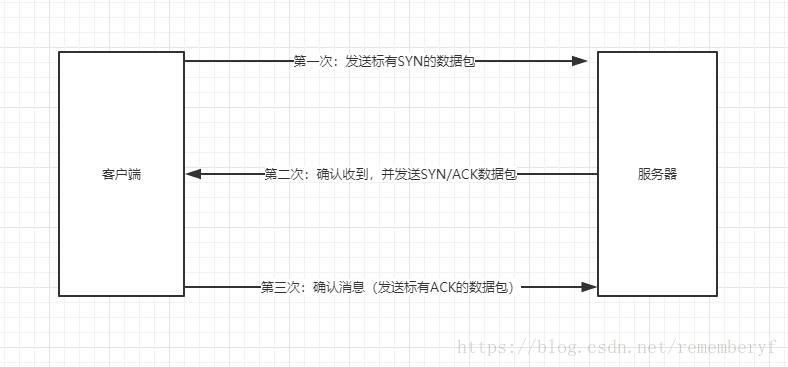
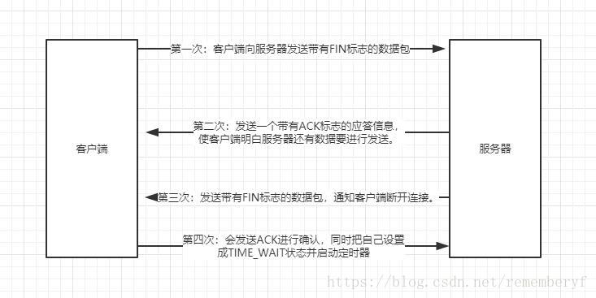

#### 三次握手

1. 客户端向服务器发起一个同步信号SYN

2. 服务器向客户端回应一个应答信号ACK，同时携带也一个同步SYN信号

3. 客户端收到服务器端回应后 再响应一个ACK信号

#### 为什么要三次握手？能不能两次？

- 在第二步的时候 服务器只能确定客户端有发送数据的能力，不能确定有接收的能力 （所以自己也发送一个）
- 第三步的时候 客户端就能确定服务器有接收和发送的能力，服务器也确定客户端有接收和发送的能力
- 所以在第三步之后才能确定双发都有能力接收发送数据。握手两次是不行的。

#### 能否在建立连接时直接带上http请求的数据？能带的话在第几步带？

- 在第三步请求时可以携带通信数据，第三步时双方通信能力基本确认没有问题了，所以可以同时把http数据带过去

#### 什么是半连接？什么是全连接？什么是syn攻击

- 半连接：就是三次握手没有完全建立时，比如只到了第2步，第三步没有发起/没有成功再重试时，系统为这种连接进行状态维护，称为半连接
- 全连接：当三次握手完成了，把这些连接放入连接池里面，称为全连接
- syn攻击：当大量的请求到达服务器时，每次请求都要建立三次握手，由于是恶意攻击使第三步迟迟不会完成，那么系统就要为维护半连接的请求耗费大量的资源，这种攻击称为syn攻击

#### 四次挥手

1. 客户端向服务器发送 FIN报文，告诉服务器 我没有东西要传给你了
2. 服务器收到客户端的FIN后，给客户端发送ACk报文 说 我还有数据要发送，请你等我。
3. 服务器等自己的数据发送完了，就给客户端发送 FIN报文 说 可以关闭了
4. 客户端收到FIN后 发送 ACK 进行确定，并启动定时器 随后进行关闭。

**在整个通信的过程中，谁先发起请求，谁就是客户端。**最后一步 当客户端收到FIN后，担心网络上某些不可控制的因素导致服务器不知道他要断开连接，会发送ACK进行确认，同时把自己设置成TIME_WAIT状态并启动定时器，**在TCP的定时器到达后客户端并没有接收到请求，会重新发送；当服务器收到请求后就断开连接；当客户端等待2MLS（两倍报文最大生存时间）后，没有收到请求重传的请求后，客户端这边就断开连接，**整个TCP通信就结束了。

#### 为什么连接的时候是三次握手，关闭的时候却是四次握手？

- 建立连接的时候 当Server端收到Client端的SYN连接请求报文后，可以直接发送SYN+ACK报文。其中ACK报文是用来应答的，SYN报文是用来同步的。
- 但是关闭连接时，当Server端收到FIN报文时，很可能并不会立即关闭链接，所以只能先回复一个ACK报文，告诉Client端，"你发的FIN报文我收到了"。只有等到我Server端所有的报文都发送完了，我才能发送FIN报文，因此不能一起发送。故需要四步握手。

#### 为什么TIME_WAIT状态需要经过2MSL(最大报文段生存时间)才能返回到关闭状态？

- 虽然按道理，四个报文都发送完毕，我们可以直接进入关闭状态了，但是我们必须假设网络是不可靠的，有可能最后一个ACK丢失。所以TIME_WAIT状态就是用来重发可能丢失的ACK报文。