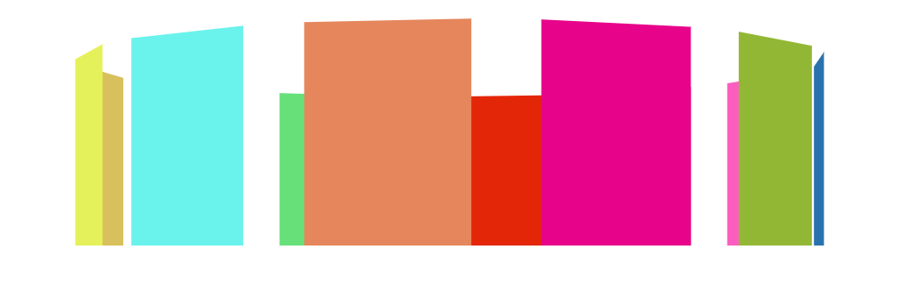

#### 演示地址：http://zmlong.usa3v.net/html/project/rotate_mua/index.html

#### 介绍：

- 利用 CSS3的动画效果 实现的一个旋转木马的效果
- 把颜色块 替换为图片效果更佳

#### 技术：

- 随机色

  - ~~~JavaScript
      divs[i].style.background = '#' + Math.floor(Math.random() * 0xffffff).toString(16).padEnd(6, '0');
    ~~~

- 动画

  - ~~~css
    @keyframes rotate {
                0% {
                    transform: rotateY(0);
                }
    
                100% {
                    transform: rotateY(360deg);
                }
            }
    ~~~

  - 使用动画

  - ~~~css
     animation: rotate 24s linear infinite;
    ~~~

  

