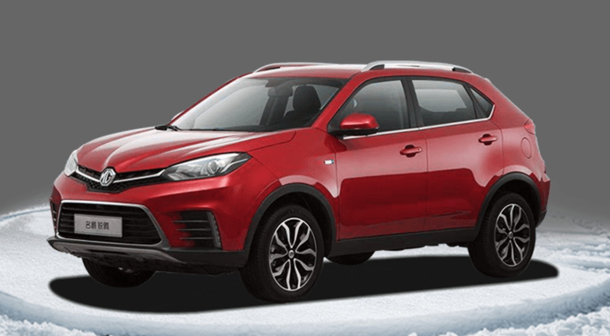

#### 演示地址：http://zmlong.usa3v.net/html/project/shoping/index.html

#### 介绍：

- 这个购物页面 是全屏滚动效果（fullPage插件），整个页面充满了HTML5的动画 当然这归功于 JQuery和easing插件
- 像这种充满动画元素而且和用户交互的页面 所表达的信息量和创意感是静态页面所没有的。

#### 技术：

- 首先整个页面是全屏滚动效果 所以必不可少的插件是 fullPage 
  - 官网：http://fullpage.81hu.com/
  - 内容很详细 一看就懂 ，要先引入JQ，因为fullPage 是基于JQ开发的
- 其次 JQ做动画也不是无敌的，有很多好看效果需要借助 easing插件
  - 官网：https://gsgd.co.uk/sandbox/jquery/easing/
  - 学习地址：https://www.runoob.com/jqueryui/api-easings.html
  - 注意都需要依赖JQ
- 然后结合 ` fullPage插件` 和` easing插件` 再用JQ写自己想要的效果 。这就很考验JQ的动画掌握能力，此页面最主要的是 JQ动画回调的运用 和对 动画运动位置的计算
- 另外 源码中 myPage.js 文件中的注释都写得很清楚

#### 另外还有一个插件叫 circlr 用来实现产品的360°旋转

- 如图

- 参考地址：https://github.com/coderzml/360du_car
- 学习地址：https://www.jb51.net/article/72460.htm

#### 更多的插件可以参考

- JQuery UI 库 https://jqueryui.com/

