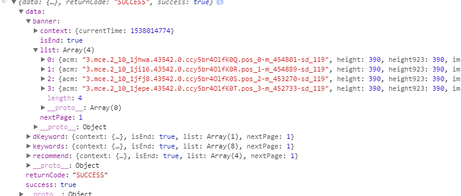
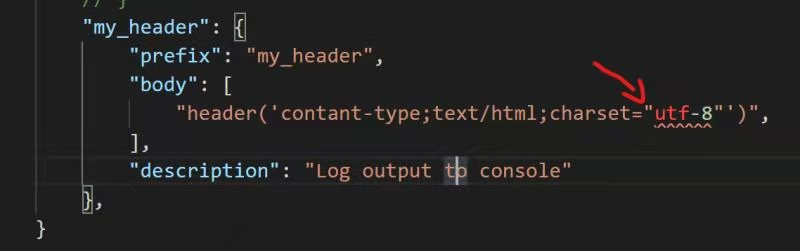

### HTML

#### form表单域会刷新页面

其解决的方法有两种:

1. 如果不希望刷新页面，使用ajax提交表单，submit按钮上要加个onclick="return false;"就可以解决这个问题！
2. 阻止form表单元素的默认行为,在点击事件中添加:event.preventDefault();阻止默认行为

### JQuery

#### JQ 创建元素的时候用$区分

- 用JQ创建元素的时候 用$开头便以区分  例

~~~js
let $cloenNode = $('.box).cloen(); 
~~~

- 用cloen容易存在分裂的问题 可以在克隆元素之前指定某一个元素 或者加 first（）；

#### 生成元素太多就用克隆

- 如果DOM中生成要生成的元素太多 可以先写好一个母版隐藏 用JQ克隆然后再添加到指定位置

~~~js
//box是模板，是不现实的
let box1 = $(".template").clone(true);
$('body').append(box1)
~~~

- clone()参数true 代表深克隆，也克隆事件处理函数	

### AJax

#### 接收数据的时候要先分析

- 接受数据的时候 先分析是什么数据类型 不要一把梭

#### 接口直接渲染到标签

- 有些时候接口不是返回内容的，而是直接返回数据的，这时就可以用src直接引入了

~~~js
//图片接口

//文字接口

~~~

- 这样就可以直接渲染到页面了

### JavaScript

#### super调用父类的构造函数

- super调用父类的构造函数的时候 必须在子类的this之前 ， 要先调用父类的构造函数才能使用子类的构造函数。可以结合记忆 父亲永远 是第一位！

~~~js
class Father {
    constructor(x,y){
        this.x = x;
        this.y = y;
    }
    sum(){
        console.log(this.x + this.y);
    }
}

class Son extends Father {
    constructor(x,y){ 
         //用super来调用父类中的构造函数
        //super必须在子类this之前调用，必须先调用父类中的构造函数，才能使用子类中的构造函数
        super(x,y);
        this.x = x;
        this.y = y;
       
    }
    subtract (){
    console.log(this.x - this.y);
    }
}

var son = new Son(5,3);
son.subtract();
son.sum();
~~~

#### className会重置类名

- className 会重置之前的类名  如果按照class选择器 会找不到元素

~~~js
<body>
   

</body>

~~~

- 解决办法：建议使用classList.add()

~~~js
	let colorRed = document.querySelector('.colorRed');
    console.log(colorRed);// 有值
    colorRed.classList.add('colorBlue');
    console.log(colorRed);// 有值
~~~

#### 构造函数内的this指向

- 在构造函数内写代码一定要考虑this指向问题 
- **如果出问题第一时间想到的就是this指向问题**

#### 给后生元素绑定事件

- 页面中添加元素导致之前的效果不能用 有可能是绑定点击事件的时候没有给后面的绑定上。
- 可以封装个函数，只有有后生的元素 就调用函数重新获取元素\

~~~js
    // 获取li函数
    function getLi() {
        let lis = document.querySelectorAll('li');
        for (let i = 0; i < lis.length; i++) {
            lis[i].index = i;
            lis[i].onclick = function () {
                console.log(this.index);
            }
        }
    }
    getLi();
    // 有后生元素 点击这个是获取不到index的
    let li = document.createElement('li');
    li.innerHTML = 6;
    document.querySelector('ul').appendChild(li);
    // 只用调用一下getLi() 就能重新绑定;
    getLi();
~~~

- 用JQ的on事件能直接避免这个问题

~~~js
 $('ul').on('click', 'li', function () {
        console.log($(this).index());
    })
    // 后来元素 
    let li = document.createElement('li');
    li.innerHTML = 6;
    document.querySelector('ul').appendChild(li);
~~~

#### ES6新出的那几个遍历的方法

- filter，map，reduce 都返回一个新数组

#### swiper，fullpage区别

swiper主要做移动端的全屏滚动效果，fullpage主要做PC端全屏滚动效果

####  创建元素速度对比

1. 原生createElement创建

~~~js
    let time = +new Date();
    for (let i = 0; i < 100; i++) {
        let li = document.createElement('li');
        li.innerHTML = i;
        document.body.appendChild(li);
    }
    let time2 = +new Date();
    console.log(time2 - time); // 区间 0-3
~~~

2. 字符串创建（先攒着最后再添加）

~~~js
let time = +new Date();
    let li = ''
    for (let i = 0; i < 100; i++) {
        li += '<li>' + i + '</li>';
    }
    document.body.innerHTML = li;
    let time2 = +new Date();
    console.log(time2 - time);//区间 0-3
~~~

3. 字符串创建（一个一个添加）

~~~js
    let time = +new Date();
    for (let i = 0; i < 100; i++) {
        let li = '<li>' + i + '</li>';
        $('body').append(li);
    }
    let time2 = +new Date();
    console.log(time2 - time); //区间 7-15
~~~

- 可见第三种最浪费性能

### Vue

#### npm安装包的时候

- 使用npm安装依赖的时候 --save-dev     -dev的意思是开发时依赖 不加就是运行时依赖  Vue就算不加 因为运行时依赖 
- --save是将包的信息记录在 package，json的文件中
- --save-dev 也是局部安装
- --global 是全局安装

#### VueCli装不上解决方案

1. 以管理员身份运行（在VScode中的终端的话可以用管理员身份运行VScode）
     - win+Q 搜索 cmd ,右键管理员运行
2. 清除缓存
3. 重装node（装C盘因为C盘权限最高）

#### 为什么有很多后缀名叫rc

- 为什么有很多后缀名叫rc  因为是一些终端的命令  run command （运行终端） 简称 rc

#### 在Vue文件中使用for要加：key

~~~vue
<li v-for='(item,index) in news' :key="index">{{item}}</li>
~~~

### 其他

#### 命名文件夹

- 命名文件夹或者文件的时候不要出现 && 关键字(符号尽量都不要出现)
- **可以出现  下划线 _  但是不能出现 + 加号**

#### 必须用双引号，且冲突

- **有些标签必须用到双引号造成双引号冲突的问题 可以用  \ 转义符 解决** 
- 比如，php的header标签，要求都用双引号

~~~php
  "header(' contant-type;text/html;charset="＋"'"＋"utf-8"＋"'"＋"')",
~~~

- 再比如用户代码片段，要求双引号 且要添加内容的时候 有时就会引起双引号冲突。

### 浏览器

#### 页面一直转圈，代码却运行正常

- 图片或文件路径的问题，建议使用本地图片路径，如果用网上的，他炸了你也炸了

#### 微信内置浏览器

- 返回上一页面会刷新的问题
- 站内搜索 ：微信内置浏览器