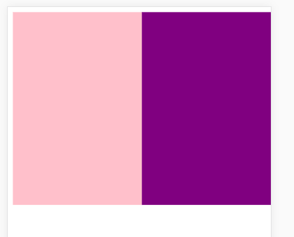
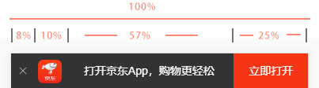

> 流式布局又称 百分比布局 就是把区域都划分成百分比的形式 达到自适应的目的
>
> 流式布局最大的优点就是不用给固定的PX 而是采用百分比的形式 能实现自由伸缩的目的

#### 预览地址：http://zmlong.usa3v.net/html/project/liushi_jd/index.html

在写布局之前我们希望初始化一下标签 比如 body、ul的内外边距，li的小点，a标签的下划线以及颜色 这些很影响页面效果的标签，都可以用 normalize.css 文件进行初始化，之后就不用操心标签的默认行为了

normalize地址：http://zmlong.usa3v.net/html/project/liushi_jd/css/normalize.css

#### 最简单的流式布局

~~~html
 

        

        

    

~~~

~~~css
.box {
            width: 100%;
            height: 300px;
            margin: 0 auto;
            max-width: 980px;
            min-width: 400px;
        }
        
        .box div {
            float: left;
            width: 50%;
            height: 100%;
        }
        
        .box div:nth-child(1) {
            background-color: pink;
        }
        
        .box div:nth-child(2) {
            background-color: purple;
        }
~~~

运行后

- 无论怎么放大缩小 始终两个快 都只占 50%

#### 京东顶部效果

- 给每一个区域都划分好固定的百分比，这样就实现了盒子的自由伸缩。

- css

- ~~~css
     body {
              width: 100%;
              height: 850px;
              min-width: 320px;
              max-width: 640px;
              margin: 0 auto !important;
              line-height: 1.5;
              font-size: 14px;
              font-family: '-apple-system', Helvetica, sans-serif;
          }
    
          .app {
              width: 100%;
              height: 45px;
              background-color: #333;
          }
    
          .app ul {
              margin: 0;
              padding: 0;
          }
    
          .app ul li {
              list-style: none;
              float: left;
              height: 45px;
              text-align: center;
              line-height: 45px;
              color: white;
          }
    
          .app ul li:nth-child(1) {
              width: 8%;
          }
    
          .app ul li:nth-child(1) img {
              width: 10px;
              height: 10px;
          }
    
          .app ul li:nth-child(2) {
              width: 10%;
          }
    
          .app ul li:nth-child(2) img {
              width: 30px;
              height: 30px;
              vertical-align: middle;
          }
    
          .app ul li:nth-child(3) {
              width: 57%;
          }
    
          .app ul li:nth-child(4) {
              width: 25%;
              background-color: #F63515;
          }
  ~~~

- html

- ~~~html
   

          <ul>
              <li class="off_app">X</li>
              <li>logo</li>
              <li>打开京东App，购物更轻松</li>
              <li>立即打开</li>
          </ul>
      

  ~~~

#### 