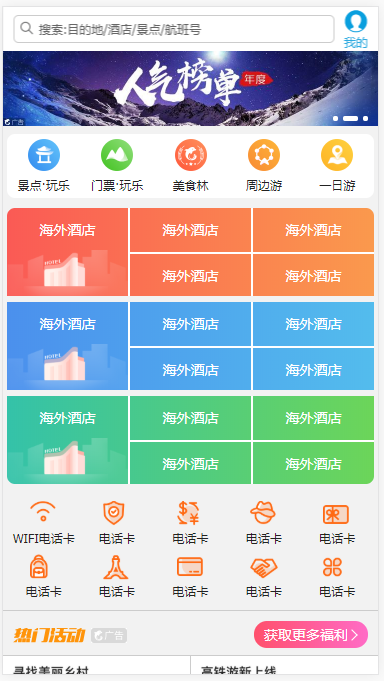

> 传统的布局 都基于盒模型，依赖 display，position，float 等属性。对于特殊的布局 居中都难实现。
>
> 所以W3C提出了flex布局，它可以简便、完整、响应式地实现各种页面布局。目前，它已经得到了所有浏览器的支持，这意味着，现在就能很安全地使用这项功能。

#### 一、Flex布局是什么？

- Flex 是 Flexible Box 的缩写，意为"弹性布局"，用来为盒状模型提供最大的灵活性。
- 任何容器都可以指定为flex布局
- 注意：设置为flex布局后 原始标签的 float ，cleat，vertical-alien 都将失效

#### 二、基本概念

- 采用 Flex 布局的元素，称为 Flex 容器（flex container），简称"容器"。它的所有子元素自动成为容器成员，称为 Flex 项目（flex item），简称"项目"。


- 容器默认存在两根轴：水平的主轴（main axis）和垂直的交叉轴（cross axis）。主轴的开始位置（与边框的交叉点）叫做`main start`，结束位置叫做`main end`；交叉轴的开始位置叫做`cross start`，结束位置叫做`cross end`。

  项目默认沿主轴排列。单个项目占据的主轴空间叫做`main size`，占据的交叉轴空间叫做`cross size`。

  

#### 三、容器的属性

- 以下6个属性设置在==容器==上。

~~~JavaScript
flex-direction 主轴的排列方向
flex-wrap  如果一行排不下如何换行
flex-flow  前两个属性的结合体
justify-content 主轴的对齐方式
align-items 交叉轴的对齐方式
align-content 多个轴体的对齐方式（仅一条轴该属性不起作用）
~~~

##### flex-direction属性

- `flex-direction`属性决定主轴的方向（即项目的排列方向）。

- ~~~JavaScript
  .box {
    flex-direction: row | row-reverse | column | column-reverse;
  }
  ~~~


- 它可能有4个值。

- ~~~JavaScript
  row（默认值）：主轴为水平方向，起点在左端。
  row-reverse：主轴为水平方向，起点在右端。
  column：主轴为垂直方向，起点在上沿。
  column-reverse：主轴为垂直方向，起点在下沿。
  ~~~

##### flex-wrap属性

- 默认情况下，项目都排在一条线（又称"轴线"）上。`flex-wrap`属性定义，如果一条轴线排不下，如何换行。


~~~JavaScript
.box{
  flex-wrap: nowrap | wrap | wrap-reverse;
}
~~~

它可能取三个值。

（1）`nowrap`（默认）：不换行。


（2）`wrap`：换行，第一行在上方。


（3）`wrap-reverse`：换行，第一行在下方。


##### flex-flow属性

- `flex-flow`属性是`flex-direction`属性和`flex-wrap`属性的简写形式，默认值为`row nowrap`。

~~~JavaScript
.box {
  flex-flow: <flex-direction> || <flex-wrap>;
}
~~~

##### vjustify-content属性

- `justify-content`属性定义了项目在主轴上的对齐方式。

~~~javascript
.box {
  justify-content: flex-start | flex-end | center | space-between | space-around;
}
~~~


它可能取5个值，具体对齐方式与轴的方向有关。下面假设主轴为从左到右。

~~~javascript
flex-start（默认值）：左对齐
flex-end：右对齐
center： 居中
space-between：两端对齐，项目之间的间隔都相等。
space-around：每个项目两侧的间隔相等。所以，项目之间的间隔比项目与边框的间隔大一倍。
~~~

##### align-items属性

- `align-items`属性定义项目在交叉轴上如何对齐。

~~~javascript
.box {
  align-items: flex-start | flex-end | center | baseline | stretch;
}
~~~


- 它可能取5个值。具体的对齐方式与交叉轴的方向有关，下面假设交叉轴从上到下。

~~~javascript
flex-start：交叉轴的起点对齐。
flex-end：交叉轴的终点对齐。
center：交叉轴的中点对齐。
baseline: 项目的第一行文字的基线对齐。
stretch（默认值）：如果项目未设置高度或设为auto，将占满整个容器的高度。
~~~

##### align-content属性

- `align-content`属性定义了多根轴线的对齐方式。如果项目只有一根轴线，该属性不起作用。

~~~css
.box {
  align-content: flex-start | flex-end | center | space-between | space-around | stretch;
}
~~~


- 该属性可能取6个值。

~~~javascript
flex-start：与交叉轴的起点对齐。
flex-end：与交叉轴的终点对齐。
center：与交叉轴的中点对齐。
space-between：与交叉轴两端对齐，轴线之间的间隔平均分布。
space-around：每根轴线两侧的间隔都相等。所以，轴线之间的间隔比轴线与边框的间隔大一倍。
stretch（默认值）：轴线占满整个交叉轴。
~~~

#### 四、项目的属性

- 以下6个属性设置在项目上。

~~~JavaScript
order   靠前靠后
flex-grow  放大默认0
flex-shrink 缩小默认1
flex-basis 设置初始值px （空间充足的情况下）
flex 平等分为几块
align-self 单独设置交叉轴的对齐方式
~~~

##### order属性

- `order`属性定义项目的排列顺序。数值越小，排列越靠前，默认为0。

~~~JavaScript
.item {
  order: <integer>;
}
~~~


##### flex-grow属性

- `flex-grow`属性定义项目的放大比例，默认为`0`，即如果存在剩余空间，也不放大。

~~~css
.item {
  flex-grow: <number>; /* default 0 */
}
~~~


- 如果所有项目的`flex-grow`属性都为1，则它们将等分剩余空间（如果有的话）。如果一个项目的`flex-grow`属性为2，其他项目都为1，则前者占据的==剩余空间==将比其他项多一倍。==注意是瓜分剩余空间 而不是 计算各自的空间==

##### flex-shrink属性

- `flex-shrink`属性定义了项目的缩小比例，默认为1，即如果空间不足，该项目将缩小。

```css
.item {
  flex-shrink: <number>; /* default 1 */
}
```


- 如果所有项目的`flex-shrink`属性都为1，当空间不足时，都将等比例缩小。如果一个项目的`flex-shrink`属性为0，其他项目都为1，则空间不足时，前者不缩小。==注意如果设置排不下不换行，默认`flex-shrink`属性为1，也就是说 只用设置 不想让缩小的那个项目就行了==
- 负值无效  这个属性和上面的放大属性值是反着的

##### flex-basis属性

- `flex-basis`属性定义了在分配多余空间之前，项目占据的主轴空间（main size）。浏览器根据这个属性，计算主轴是否有多余空间。它的默认值为`auto`，即项目的本来大小。

```css
.item {
  flex-basis: <length> | auto; /* default auto */
}
```

- 它可以设为跟`width`或`height`属性一样的值（比如350px），则项目将占据固定空间。
- 等于说这个属性是 如果有剩余的空间 提前设置项目的大小

##### flex属性

- `flex`属性是`flex-grow`, `flex-shrink` 和 `flex-basis`的简写，默认值为`0 1 auto`。后两个属性可选。

```css
.item {
  flex: none | [ <'flex-grow'> <'flex-shrink'>? || <'flex-basis'> ]
}
```

- 该属性有两个快捷值：`auto` (`1 1 auto`) 和 none (`0 0 auto`)。
- 前者：==可放大可缩小==
- 后者：==不放大不缩小==

##### align-self属性

- `align-self`属性允许单个项目有与其他项目不一样的对齐方式，可覆盖`align-items`属性。默认值为`auto`，表示继承父元素的`align-items`属性，如果没有父元素，则等同于`stretch`。

```css
.item {
  align-self: auto | flex-start | flex-end | center | baseline | stretch;
}
```


- 该属性可能取6个值，除了auto，其他都与align-items属性完全一致。
- 如果有多个轴 这个属性不起作用

#### 五、实战



##### 预览地址：http://zmlong.usa3v.net/html/project/xiecheng/index.html

**网络筛子实战以及其他布局学习地址：http://www.ruanyifeng.com/blog/2015/07/flex-examples.html**

