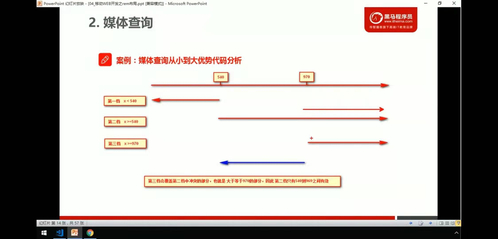

#### em和rem的区别

##### em 

- em是相对于**父级文字大小**来说的

- ~~~css
    
  
  <body>
      

          

      

  </body>
  ~~~

- em很难实现整体控制效果，因为页面中父元素的字体大小都不一样

- **注意：**任意浏览器的默认字体高都是16px。所有未经调整的浏览器都符合: 1em=16px。那么12px=0.75em,10px=0.625em。为了简化font-size的换算，需要在css中的body选择器中声明Font-size=62.5%，这就使em值变为 16px\*62.5%=10px, 这样12px=1.2em, 10px=1em, 也就是说只需要将你的原来的px数值除以10，然后换上em作为单位就行了。

##### rem

- rem （root em，根em）是相对 页面中的**html文字大小**来说的

- ~~~css
     html {
              font-size: 12px;
          }
  
          .box {
              width: 15rem;
              height: 15rem;
              background-color: purple;
          }
  
  ~~~

- rem的优点就是可以通过修改html里面的文字大小来改变页面中元素的大小，可以实现整体控制效果

- 也就说 使用rem可以使页面的大小 根据 html的文字大小而改变

- 兼容性

- ~~~css
  p {font-size:14px; font-size:.875rem;}
  ~~~

- 如果是进行的移动端开发就不用考虑兼容性了，IE8之前 这样处理兼容，不支持rem的会直接忽略。

#### 媒体查询

- 语法规范

~~~css
@media mediatype and|not|only (media featrue) {

}
~~~

- @media代表声明媒体查询
- mediartpe 是媒体类型
  - all 用于所有设备
  - print 打印机
  - scree **电脑屏幕、平板电脑、智能手机**
- 关键字 and not only 
  - **and**  并且的意思 媒体特性链接到一起
  - not 排除某个媒体特性
  - only 指定特定的媒体类型
- media featrue 媒体特性 必须有小括号
  - width 定义输出设备中页面可视区域的宽度
  - min-width 定义输出设备中页面最小可视区域
  - max-width 定义输出设备中页面最大可视区域

~~~css
    /* 在800像素以内 */
        @media screen and (max-width:800px) {
            body {
                background-color: pink;
            }
        }
~~~

##### 根据不同大小改变颜色

~~~css
    /* 在539像素以内 */
        @media screen and (max-width:539px) {
            body {
                background-color: palegreen;
            }
        }

        /* 超过540像素 */
        @media screen and (min-width:540px) {
            body {
                background-color: pink;
            }
        }

        /* 超过970像素 */
        @media screen and (min-width:970px) {
            body {
                background-color: purple;
            }
        }
~~~

- 尽量从小到大或者从大到小的写，因为样式有层叠性 后面的样式会把前面的给覆盖掉

##### 媒体查询+rem实现元素动态大小

~~~css
  

<body>
    
我是文字

</body>
~~~

- 通过媒体查询改变html的文字大小  也就 改变了元素大小