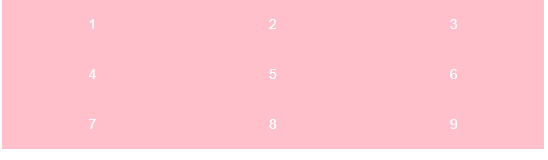
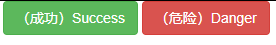
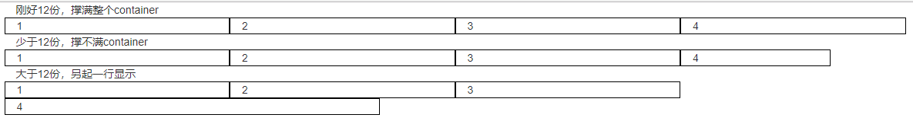
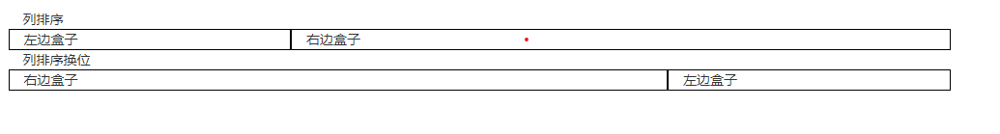

[TOC]

#### 响应式

- 响应式需要一个父级作为布局容器，来配合子元素实现变化效果

- 原理是在不同屏幕下，通过媒体查询来改变这个布局容器的大小，再改变里面子元素的排列方式和大小，从而实现不同屏幕下，看到不同的页面布局和样式的变化

  一般把屏幕分为四类

|       **设备划分**       |      尺寸区间      |
| :----------------------: | :----------------: |
|     超小屏幕（手机）     |      < 768px       |
|     小屏设备（平板）     | >= 768px ~ < 992px |
|  中等屏幕（桌面显示器）  | >= 992px ~ <1200px |
| 宽屏设备（大屏幕显示器） |     >= 1200px      |

- 就可以根据这四个区间去设置响应式

~~~css
  .container {
            height: 150px;
            background-color: pink;
            margin: 0 auto;
        }

        /* 根据不通屏幕下显示不同的宽度 */
        /* 小于768（手机） */
        @media screen and (max-width:768px) {
            .container {
                width: 100%；
            }
        }

        /* 大于768（平板） */
        @media screen and (min-width:768px) {
            .container {
                width: 750px;
            }
        }

        /* 大于992（桌面显示器） */
        @media screen and (min-width:992px) {
            .container {
                width: 1200px;
            }
        }

        /* 大于1200（大屏幕显示器） */
        @media screen and (min-width:1200px) {
            .container {
                width: 1500px;
            }
        }
~~~

##### 响应式导航

- 在屏幕小于648的时候，导航一行排三个，在大于648的时候 排一行

~~~css
 

<body>
    

        <ul>
            <li>1</li>
            <li>2</li>
            <li>3</li>
            <li>4</li>
            <li>5</li>
            <li>6</li>
            <li>7</li>
            <li>8</li>
            <li>9</li>
        </ul>
    

</body>
~~~

#### Bootstrap前端开发框架

- bootstrap是基于html、css、JavaScript 开发的框架，它简洁灵活、使得web开发更加灵活
- 中文官网：https://www.bootcss.com/

##### 使用

- 下载相应的文件后 引入
- 在boot的官网中 找你喜欢的样式，然后复制到你自己的html中即可
- 使用的方法这里就不赘述了，官网讲的比我清楚

##### 响应式的布局容器

1. container类

~~~html
 

        <button type="button" class="btn btn-success">（成功）Success</button>
        <button type="button" class="btn btn-danger">（危险）Danger</button>
    

~~~

- 有了container类，就不用再写媒体查询了，因为boot内部都已经写好了 分别是
- 大屏（>=1200px） 宽度定为 1170px
- 中屏（>=992px） 宽度定为970px
- 小屏（>=768px） 宽度定为750px
- 超小屏（100%）
- 一个页面中不是只能有一个container类，可以根据需求搭配使用

2. container-fliud

- 流式布局容器 百分比宽度
- 占据全部视口的容器
- 适合于单独做移动端开发

##### 栅格系统

- 又叫网格系统，它指将页面布局划分为等宽的列，然后通过列数的定义来模块化页面布局
- boot提供了一套响应式、移动设备优先的流式栅格系统，随着屏幕或者视口尺寸的增加，系统会自动分为12等份。
- 不管是在小屏幕下还是在大屏幕下 都是把页面划分为12等份，当屏幕缩小的时候每一份也会跟着缩小，就实现了响应式的效果 ，份数不变（默认）

###### 栅格系统选项参数（类）

栅格系统通过用一系列的行（row）和列（Colum）来组合创建的布局

|                    | 超小屏幕（手机）<768px | 小屏设备（平板）>=768px | 中等屏幕（桌面显示器）>=992px | 宽屏设备（大屏幕显示器）>=1200px |
| :----------------: | :--------------------: | :---------------------: | :---------------------------: | :------------------------------: |
| .conrainer最大宽度 |      自动（100%）      |          750px          |             970px             |              1170px              |
|       类前缀       |        .col-xs-        |        .col-sm-         |           .col-md-            |             .col-lg-             |
|   列（column）数   |           12           |           12            |              12               |                12                |

- **行（row） 必须放到container布局容器里面**
- **我们实现列的平均划分，需要给列添加类前缀**
- **xs-extra small:超小、sm-small:小、md-medium：中等、lg-large:大；**
- **每一列默认有左右15px的padding**
- **可以同时给一列指定多个设备的类名，以便划分不同的份数，列入 class=“col-xs-3 col-lg-5”，当屏幕大小发生改变就会调用不通的类**

~~~css
   

            1
            2
            3
            4
        

~~~

- 每行（row）平分的12份，少于12会出现 填不满的情况。大于12份会另起一行显示。

~~~css
    

        <!-- 刚好12份，撑满整个container -->
        

            1
            2
            3
            4
        

        <!-- 少于12份，撑不满container -->
        

            1
            2
            3
            4
        

        <!-- 大于12份，另起一行显示 -->
        

            1
            2
            3
            4
        

    

~~~

分析bootstrap官网的盒子排列

- 在超大屏幕下一行排4个，中等屏幕下排3个，小屏幕下排2个，超小屏幕下排1个
- 这里是从小到大的顺序

~~~css
   

            1
            2
            3
            4
   

~~~

- 关于官网每个盒子的间距，不是用margin写的，因为每个盒子的宽度是33.33%了，再加margin一定会给盒子挤下来。当然也不是padding。实现的过程是 再套一个盒子比33.33%这个盒子小点，而33.33这个盒子是不显示的.显示的是里面那个盒子

##### 列嵌套

~~~css

            <!-- 每一列中的盒子默认也有12份 -->
            
                不加row
                不加row
            
            
                <!-- 上面那个盒子默认会有15px的左右padding -->
                <!-- 所以建议列嵌套的时候 再加个row盒子，这样可以抵消padding还能自动和父元素一样高 -->
                

                    加row
                    加row
                

            
        

~~~

- 所以在列嵌套的时候建议加个row盒子，抵消padding。

##### 列偏移

-  原理是给盒子加左外边距
- 关键字：col-(视口)-offset-偏移几份

~~~css
   		两边平分，中间留白
        

            
左青龙

            
右白虎

        

        两边留白，中间居中
        

            
我自己占八份

        

~~~

##### 列排序

- col-（视口）-pull-份数   ： 拉

- col-（视口）-push-份数   ： 推

~~~css
  列排序
        

            
左边盒子

            
右边盒子

        

        列排序换位
        

            
左边盒子

            
右边盒子

        

~~~

- 一个往后推7份，一个往前拉三分。就形成了排序（换位）

##### 响应式工具

- 为了加快对移动设备友好的页面开发工作，利用媒体查询功能，并使用这些工具类可以方便的针对不通设备展示或隐藏页面内容

| 类名       | 超小屏 | 小屏 | 中屏 | 大屏 |
| ---------- | ------ | ---- | ---- | ---- |
| .hidden-xs | 隐藏   | 显示 | 显示 | 显示 |
| .hidden-sm | 显示   | 隐藏 | 显示 | 隐藏 |
| .hidden-md | 显示   | 显示 | 隐藏 | 显示 |
| .hidden-lg | 显示   | 显示 | 显示 | 隐藏 |

~~~CSS
 

            
1

            
2

            
到了中屏幕我就消失

            
4

        

~~~

- 如果只设置在中屏消失，那么在小屏和最小屏就会出现，如果也想不让出现 就同样也设置隐藏

- 后面的col-md-4的作用是 在第三个块消失后，就撑不满整个container了 就重新平分一下

**与之对应的是显示**

| 类名        | 超小屏 | 小屏 | 中屏 | 大屏 |
| ----------- | ------ | ---- | ---- | ---- |
| .visible-xs | 显示   | 隐藏 | 隐藏 | 隐藏 |
| .visible-sm | 隐藏   | 显示 | 隐藏 | 隐藏 |
| .visible-md | 隐藏   | 隐藏 | 显示 | 隐藏 |
| .visible-lg | 隐藏   | 隐藏 | 隐藏 | 显示 |

~~~css
 

            

                <h1 class="visible-md visible-lg">我到了中屏和大屏幕才会显示</h1>
            

            
2

            
3

            
4

        

~~~

- 反之  在大屏幕和超大屏幕之外 都会隐藏

#### 实战——阿里百秀

参考地址：http://zmlong.usa3v.net/html/project/alibaixiu/index.html

