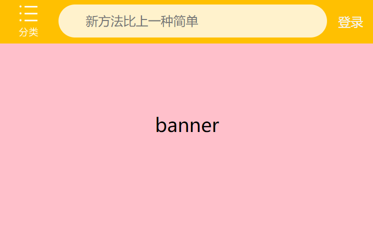
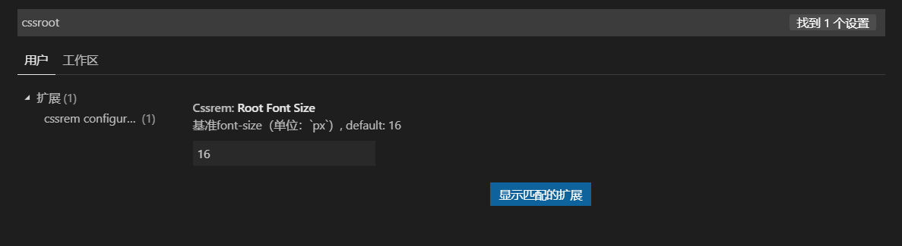

> flexible 是淘宝团队出的一个简洁高效的移动端适配库，它把页面化为10等份，用JS动态测量设备大小，然后动态不间断设置ｈｔｍｌ的文字大小

github地址：https://github.com/amfe/lib-flexible

- 下载完之后 默认名是index.js 
- 下载完后之后引入就行了，==会根据屏幕 自动划分10等份，在屏幕缩小或者放大的过程中 会不断给html改变文字大小 达到 自适应的目的==

~~~css

~~~

- 查看是否引入成功的方法是 改变屏幕大小 看html有没有被支持赋值

#### cssrem插件

- 在用flexible的时候 也是有把单位改为rem的 那是不是还要用less呢
- 接下来推荐一个px转rem的插件（vscode）——cssrem
- 安装完之后 在敲px的时候下面就多了一个选项 代表是不是要转为rem
- 默认1rem是16px 当然是要修改的 修改步骤如下
  1. 点击设置——设置
  2. 搜索：cssroot 
  3. 修改为 你划分计算后的结果（标准尺寸 / 划分的分数 ，这里的标准尺寸是750，划分的分数 flexible默认为10，那这个值就要修改为75），保存即可

#### 实现

~~~html
<body>
    

        
        

            <form action="">
                <input type="text" name="" id="" placeholder="新方法比上一种简单">
            </form>
        

        <a href="#" class="login">登录</a>
    

</body>

</html>

~~~

~~~css
/* 当屏幕超过750的时候 就按750处理 */
@media screen and (min-width:750px) {
    html {
        font-size: 75px!important;
    }
}
body {
    width: 10rem;
    min-width: 320px;
    margin: 0 auto;
    line-height: 1.5;
    background-color: #f5f5f5;
}
.search-copntent {
    position: fixed;
    display: flex;
    top: 0;
    width: 10rem;
    height: 1.173333rem;
    background: #FFC001;
}
.search-copntent .classify {
    width: .586667rem;
    height: .933333rem;
    background: url(../images/classify.png);
    margin: 0.1rem 0.5rem 0.14rem 0.48rem;
    background-size: .586667rem .933333rem;
}
.cearch {
    flex: 1;
}
.cearch input {
    box-sizing: border-box;
    outline: none;
    border: none;
    margin-top: .133333rem;
    padding-left: .733333rem;
    width: 100%;
    height: .88rem;
    border-radius: .44rem;
    background-color: #FFF2CC;
    font-size: .333333rem;
}
.login {
    width: 1rem;
    height: .933333rem;
    margin: .133333rem;
    color: #f5f5f5;
    font-size: .333333rem;
    text-align: center;
    line-height: .933333rem;
    text-decoration: none;
}
~~~

- 此时你再改变屏幕就会发现，元素跟随屏幕大小一起自适应
- 需要注意的是：要设置最大宽度和最小宽度

#### 查看效果：http://zmlong.usa3v.net/html/project/flexible_rem/index.html

