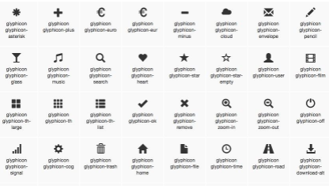
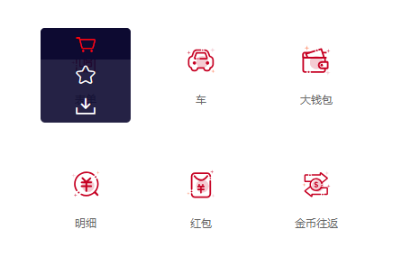
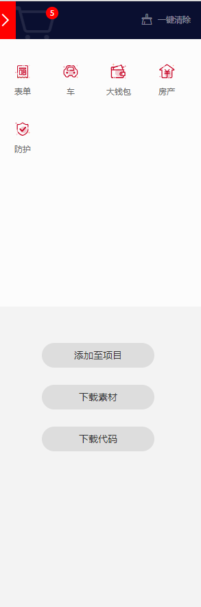
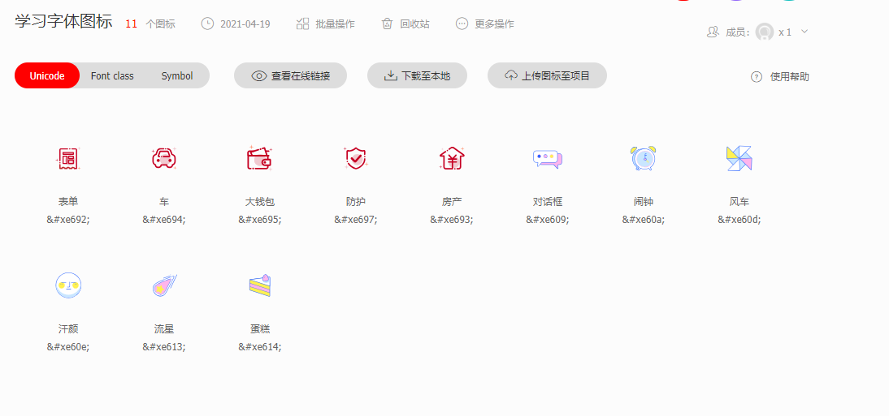
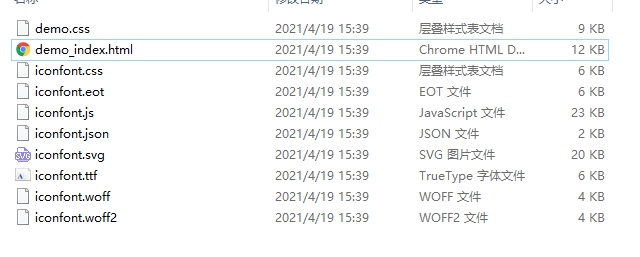
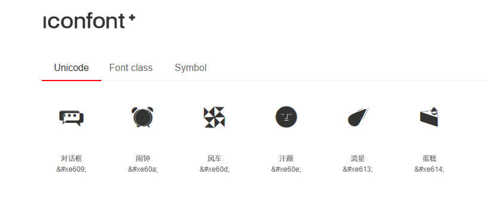

#### 什么是字体图标？

- 字体图标简单的说，就是一种特殊的字体，通过这种字体，显示给用户的就像一个个图片一样。如下图：

- **字体图标最大的好处，在于它不会变形和加载速度快。字体图标可以像文字一样，随意通过CSS来控制它的大小和颜色，对于建网站来说，特别方便。**

推荐字体图标库：

- 阿里巴巴矢量图标库：https://www.iconfont.cn/

- 阿里巴巴旗下的一个图标库，字体图标全，功能多，支持在线地址测试

#### 第一步

- 打开官网（首次要注册）选择你要用到的图标 点击加入购物车（不要下载，等会统一下载）
- 

#### 第二步

- 

- 点击右上角购物车就可以看到刚刚添加的字体
- 这里建议点击**添加至项目** 因为后面添加的时候方便。
- 第一次点击添加到项目应该是没有项目的 ，所以系统会提示创建一个项目 命个名就好了。

- 之后就会来到这个页面
- 简单介绍一下 这四个按钮的用处
  - unicode            代码引入字体图标
  - font class        class引入字体图标
  - symbol              JS引入字体图标
  - 查看在线链接是 代码引入字体图标的时候，不用用本地的，而是用的项目的链接，测试方便 后面会将。
  - 下载至本地 就是下载按钮
  - 上传图标至项目
    - 这个的用处是：把你项目之外的图标，上传到项目里面
    - 比如：上次下载的图标，合并到这个项目里面

#### 第三步

- 下载至本地并解压 得到

- ==把整个文件夹复制到你文件的根目录下==
- demo_index.html 就是对整个项目使用的介绍，相当有用
- 其他的除了 一个css文件，和js文件，都是我们刚刚加入到购物车的字体图标
- 点开demo_index.html 可以看到

一共三种使用方法，非常的详细！！！

选择任意一种使用即可，其中symbol是支持彩色图标的

假设我们这里用第一种

按照提示引入CSS

~~~js
  
~~~

HTML

~~~js
&#xe609;
~~~

- span的内容 就是 demo_index.html 提供的代码，用哪个引入那个就行了
- 更换字体图标的时候 上面的css不用改，只用换字体图标代码就行
- ==修改路径，因为复制的是文件夹 而非文件，所以要改下url路径==

~~~css
  
~~~

- 注意对比

#### 更新字体图标

- 假设现在字体图标不够用了，或者要换新的
- 在阿里巴巴矢量图标库里找到项目 可以把不要的删除
- 添加的时候 重复，第一步，第二步 的时候点击添加到你所创建的项目，第三步下载完成后 把本地的字体图标问加减全部替换为刚刚下载的字体图标文件夹就行了。

