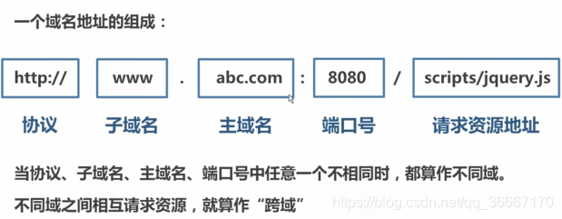

#### PHP基础知识

1. 数据库管理员：DBA

2. echo PHP中的输出语句

3. apache web服务器的意思

4. php 忘记加；会报错

5. b（browser浏览器）/ s（server服务器）和c（client客户端）/ s（server服务器）

   -  b/s优势
      - 开发成本低
      - 维护简单
      - 产品升级便利
      - 对用户培训费用低
      - 用户使用方便、出现故障概率小
   -  b/s劣势
      - 安全低；
      - 客户端不能随心变化，受浏览器限制。
   -  c/s优势
      - 充分发挥客户端PC的处理能力，很多工作可以在客户端处理后再提交给服务器。
        劣势：
   -  c/s劣势
      - 只适用于局域网
      - 客户端需安装专用的客户端软件
      - 对客户端的操作系统一般也有限制

6. php的数组

   ~~~php
   $myarr = array(1,2,3);
   echo $myarr[1];
   ~~~

7. 打印复杂数据类型

   print_r（变量）；

8. 接受前台提交的数据

   ~~~php
   $_GET();
   ~~~

9. 数组长度 count（数组);

10. 表单的提交方式

    ~~~html
    <form action="./Star.php" method="GET" name="uname">
    //记得表单加name属性
    //这种提交数据方式会刷新页面
    //form表单提交的本质是在url的后面拼接name和value
    //上传文件form表单要加的一句话
    enctype="multipart/form-data"
    ~~~

     

11. php获取上传文件时会到临时目录中 一旦php执行完毕临时目录就会销毁

    sleep(5) 方法 是延时执行的意思 单位是s

    移动上传的文件 move_uploaded_file() 第一个参数是是移动谁 第二个参数是移动到哪去（注意要加个名字）

12. 报文是什么？（http协议）请求报文  相应报文 

    - 请求报文 包括（1）请求行（2）请求头（3）请求主题  主要是 发送的方法 浏览器的信息 以及发送的数据
    - 相应报文 包括 （1）状态行（2）响应头（3）相应主题 主要是 服务器的信息 浏览器的内容 以及请求是否成功

#### AJAX基础知识

##### 页面提交数据的几种方式

1. form表单

   因为这种方式提交数据会刷新页面 提交的时候还要传属性所以渐渐被Ajax替代

2. ajax

   不刷新提交（获取）数据，容量大

##### 请求类型

1. get请求
   - 测试方便
   - 不安全 因为数据都在url里所以通常测试用
   - 限制大小不能提交大数据
2. post请求
   - 相对get来说安全 
   - 不限制大小可以提交大文件

##### 发送数据的几个步骤

~~~javascript
// 点击事件
document.querySelector('input').onclick = function(){
//1.创建对象
var xhr = new XMLHttpRequest();
//2.设置请求行(参数1：请求类型；参数二：请求地址；参数三：是否异步)
xhr.open('get','getData.php?name=rose&skill=swim',false);
//3.设置请求头(get请求可以省略,post不发送数据也可以省略)
// xhr.setRequestHeader(Content-type","application/x-www-form-urlencoded)
 //3.5注册回调函数
 xhr.onreadystatechange = function () {
// 获取数据
 if (xhr.readyState == 4 && xhr.status == 200) {
       	   console.log('请求成功');
   		   console.log(xhr.responseText);
    }
// 修改页面的dom元素
document.querySelector('h3').innerHTML = xhr.responseText;
    }
//4.请求主体发送(get请求为空，或者写null，post请求数据写在这里，如果没有数据，直接为空或者写null)
    xhr.send(null);
  }
~~~

~~~javascript
//原生写法
$.ajax({
    url: ,
    type: '',
    dataType: 'jsonp',
    success: function(){
         
    },
    error: function(){
          
    }
 })
~~~

ajax发送数据于表单请求头的区别 （重点）

- ajax get发数据 请求头可以不写 

- post发数据要更改请求头的内容为

  - ~~~javascript
    "Content-type","application/x-www-form-urlencoded"
    ~~~

- form上传文件要改为

  - ~~~javascript
    enctype="multipart/form-data"
    ~~~

  - method="POST"规定了form的上传方式

##### onreadystatechange事件 

- 因为这个事件是状态该变时就执行没有可控性所以要加判断条件

- xhr.readyState 是请求的次数  一共要四次 所以 xhr.readyState为4 的时候证明请求回来了

- xhr.status是请求的状态 200代表成功  404代表页面不存在

- 所以判断条件可以这样写

   ~~~javascript
  	if (xhr.readyState == 4 && xhr.status == 200) {
         	   console.log('请求成功');
      }
   ~~~

- XML最后拿数据的时候拿的是innerhtml(字符串) 而不是 标签

##### 请求失败

- error 错误请求后函数内的三个参数
  - XMLHttpRequest异步对象
  - textStatus错误信息
  - errorThrown错在哪里

##### ajax事件

~~~JavaScript
$(document).ajaxStart(function () {	//请求开始
        $('.cover').show();
    });
$(document).ajaxComplete(function () {	//请求完成
        $('.cover').hide();
   });
~~~

- 其他的事件可以查文档

##### 同源和不同源

- 同源：协议名 地址 端口 一样
- 不同源：协议名 地址 端口 其中有一个不一样便是 不同源

##### 跨域和解决跨域

- 什么是跨域？
  - 什么是跨域呢？简单来说就是因为JavaScript同源策略的限制，a.com域名下的js无法操作b.com或者c.a.com域名下的对象。



JavaScript出于安全方面的考虑，不允许跨域调用其他页面的对象。

~~~css
www.abc.com/index.html --> www.abc.com/service.php（非跨域）
www.abc.com/index.html --> www.efg.com/service.php（跨域 主域名不同）
www.abc.com/index.html --> bbs.abc.com/service.php（跨域 子域名不同）
www.abc.com/index.html --> www.abc.com: 81/service. php（跨域 端口号不同）
www.abc.com/index.html --> https:/www.abc.com/service.php（跨域 协议不同）
~~~

- 解决跨域

###### 后台设置PHP头

~~~php
 header("Access-Control-Allow-Origin:*");
~~~

- 台无需任何设置，在后台被请求的PHP文件中，写入一条header。
-   --- 表示允许哪些域名请求这个PHP文件，*表示所有域名都允许

###### SRC+JSONP

- **原有src属性的标签自带跨域功能；所以可以使用script标签的src属性请求后台数据**

- ~~~JavaScript
   <script src="http://127.0.0.1/json.php">< /script>
  ~~~

- 主要原理是利用了script **标签可以跨域请求的特点**

- JSONP的是在script标签的src里用get的方式拼接请求的数据 
- JSONP可用于解决主流浏览器的跨域数据访问的问题。但是有个缺陷，**只能解决get请求，不能解决post请求。**
- **用于src在加载数据成功后，会直接将加载的内容放到script标签中；所以，后台直接返回JSON字符串将不能在script标签中解析。因此，后台应该返回给前台一个回调函数名，并将JSON字符串作为参数传入。**
- **主要方法是**：动态创建script标签并让src指向后端，后端返回脚本内容，触发浏览器立即加载并执行相应js代码，从而实现前后端无刷新数据交互。

~~~JavaScript
<script>
    var script = document.createElement('script');
    //script.type = 'text/javascript';
    script.src = 'http://localhost:8080/json/?callback=handleData';
    document.body.appendChild(script);
    // 回调执行函数
    function handleData(res) {
        console.log(res);
    }
</script>
~~~

###### JQ中的JSONP

~~~javascript
$.ajax({
    url: ,
    type: '',
    dataType: 'jsonp',
    success: function(){
         
    },
    error: function(){
          
    }
 })
~~~

- dataType 设置 jsonp，就能实现跨域了，注意后台也需要相应设置

##### form表单格式化（JQuery）

~~~javascript
var result = $('form').serialize(); 全部提交的意思
~~~


#### JSON

1. JSON是一种数据的格式
2. JSON跟编程语言没有关系
3. JSON的载体是字符串(所以用的时候要转换)
4. 基本上所有的编程语言都支持JSON
5. 语法简洁 基本上所有的编程语言 都提供了对应的方法 来解析JSON
6. JSON格式的字符串 转化完毕之后 会变成 数组 对象
7. 书写属性的时候必须用双引号

~~~json
{
  "home_info": {
    "blog_name": "/image/home/coderzml.png",
    "blog_bg": "/image/home/header_BG.jpg",
    "blog_font": "coderzml是一个关注前端技术的个人博客，用来记录学习和工作总结。",
    "nav": [
      "首页",
      "HTML+CSS",
      "JavaScript",
      "JQuery",
      "作品集",
      "关于我"
    ]
  }
}
~~~

#### art-template模板引擎

> art-template 是一个简约、超快的模板引擎。
>
> 它采用作用域预声明的技术来优化模板渲染速度，从而获得接近 JavaScript 极限的运行性能，并且同时支持 NodeJS 和浏览器

1. 下载引入

   官网：https://aui.github.io/art-template/zh-cn/docs/index.html

   ~~~JavaScript
   <!-- 引入模板文件 -->
   <script src="./template.js"></script>
   ~~~

2. 定义模板

   ~~~JavaScript
   <script type="text/template" id="tmp">
       <!-- 输出和原文输出 -->
       <p>我叫{{name}}</p>
       <p>我叫{{@provices}}</p>
       <!-- 循环内容 -->
       <h1> 我的爱好是 {{each hobbies}} {{$value}} {{/each}} </h1>
       <!-- 循环标签 -->
       {{each hobbies}} <h2>{{$value}}--{{$value}}</h2>  {{/each}}
       <!-- 条件判断 -->
       {{if isShow.flag}} <h5>{{isShow.font}}</h5>{{/if}}
   </script>
   ~~~

   - 还有很多语法在官网都能查到
   - 简书版：https://www.jianshu.com/p/d8d8e19157e0
   - **模板写入script的原因**
     - 如果写入到JS变量中，维护不方便，不能换行，没有着色
     - 写入到script标签中，innerHTML不会显示在界面上
     - 注意：script标签里如果type类型不是text/JavaScript，标签内容不会按照js文件执行

3. 使用模板

   ~~~JavaScript
   <script>
       let data = {
           name: "zml",
           provices: '地球',
           hobbies: ['打游戏', '敲代码', '旅游', '听歌'],
           isShow: {
               flag: false,
               font: '显示'
           }
       }
   	// templata  参数1：模板的id 参数2：填充的数据
       let html = template('tmp', data);
       let p = document.querySelector('p');
       p.innerHTML = html;
   </script>
   ~~~

#### promise

##### promise是什么？

- 主要用于异步计算
- 可以将异步操作队列化，按照期望的顺序执行，返回符合预期的结果
- 并未剥夺函数return的能力，因此无需层层传递callback，进行回调获取数据

##### 异步回调的问题(回调地狱)

- 之前处理异步是通过纯粹的回调函数的形式进行处理
- 很容易进入到回调地狱中，剥夺了函数return的能力
- 问题可以解决，但是难以读懂，维护困难
- 稍有不慎就会踏入**回调地狱** - 嵌套层次深，不好维护


- 一般情况我们一次性调用API就可以完成请求。有些情况需要多次调用服务器API，就会形成一个链式调用，比如为了完成一个功能，我们需要调用API1、API2、API3，依次按照顺序进行调用，这个时候就会出现回调地狱的问题

##### promise语法

~~~javascript
 new Promise(function (resolve, reject) {
        setTimeout(function () {
            resolve('hello');
        }, 2000);
    }).then(function (re) {
        console.log(re);
    }).catch(function (err) {
        console.log(err);
    })
~~~

简写

~~~JavaScript
//这种简写语法也可以 使用了箭头函数
new Promise(
  function (resolve, reject) {
    // 一段耗时的异步操作
    resolve('成功') // 数据处理完成
    // reject('失败') // 数据处理出错
  }
).then(
  (res) => {console.log(res)},  // 成功
  (err) => {console.log(err)} // 失败
)
~~~

分离写法

~~~JavaScript
    // 请求
    let data1 = new Promise(function (resolve, reject) {
        setTimeout(function () {
            resolve('music2');
        }, 1000);
    })
    // then
    data1.then(function (data) {
        console.log(data);
    })
    data1.catch(function (err) {
        console.log(err);
    })
    // then也可以这样写 省去了catch
    data1.then((res) => { console.log(res) }, (err) => { console.log(err) })
~~~

- resolve作用是，将Promise对象的状态从“未完成”变为“成功”（即从 pending 变为 resolved），在异步操作成功时调用，并将异步操作的结果，作为参数传递出去；
- reject作用是，将Promise对象的状态从“未完成”变为“失败”（即从 pending 变为 rejected），在异步操作失败时调用，并将异步操作报出的错误，作为参数传递出去。
- 当promise状态发生改变，就会触发then()里的响应函数处理后续步骤；

##### then

- 接收两个函数作为参数，分别代表fulfilled（成功）和rejected（失败）
- .then()返回一个新的Promise实例，所以它可以链式调用
- 当前面的Promise状态改变时，.then()根据其最终状态，选择特定的状态响应函数执行

链式调用

~~~JavaScript
   new Promise(function (resolve, reject) {
        setTimeout(function () {
            resolve('hello');
        }, 2000);
    }).then(function (re) {
        // 第二个promise
        console.log(re);
        return new Promise(function (resolve, reject) {
            setTimeout(function () {
                resolve('world');
            }, 2000);
        })
    }).then(function (re) {
        console.log(re);
        // 第三个then
        return new Promise(function (resolve, reject) {
            setTimeout(function () {
                resolve('music');
            }, 1000);
        })
    }).then(function (re) {
        console.log(re);
    })
~~~

##### primise.all批量执行

- Promise.all([p1, p2, p3])用于将多个promise实例，包装成一个新的Promise实例，返回的实例就是普通的promise
- 它接收一个数组作为参数
- 数组里可以是Promise对象，也可以是别的值，只有Promise会等待状态改变
- **当所有的子Promise都完成，该Promise完成，返回值是全部值得数组**
- **有任何一个失败，该Promise失败，返回值是第一个失败的子Promise结果**

~~~javascript
    let pro1 = new Promise(function (resolve, reject) { resolve('成功了1'); reject('失败1') });
    let pro2 = new Promise(function (resolve, reject) { resolve('成功了2'); reject('失败2') });
    let pro3 = new Promise(function (resolve, reject) { reject('失败3') });
    Promise.all([pro1, pro2, pro3]
    ).then(function (result) {
        console.log(result);
    }).catch(function (err) {
        console.log(err);
    })

// 或者

//切菜
    function cutUp(){
        console.log('开始切菜。');
        var p = new Promise(function(resolve, reject){        //做一些异步操作
            setTimeout(function(){
                console.log('切菜完毕！');
                resolve('切好的菜');
            }, 1000);
        });
        return p;
    }

    //烧水
    function boil(){
        console.log('开始烧水。');
        var p = new Promise(function(resolve, reject){        //做一些异步操作
            setTimeout(function(){
                console.log('烧水完毕！');
                resolve('烧好的水');
            }, 1000);
        });
        return p;
    }

    Promise.all([cutUp(), boil()])
        .then((result) => {
            console.log('准备工作完毕');
            console.log(result);
        })
~~~

- 注意promise ALL 的then的成功是 必须是全部都成功 失败是只要有一个失败就会失败
- promise可以链式调用     then点then 而不是then套then

##### Promise.race

- 竞速的意思 谁先加载成功谁先上   

```JavaScript
let p1 = new Promise(resolve => {
    setTimeout(() => {
        resolve('I\`m p1 ')
    }, 1000)
});
let p2 = new Promise(resolve => {
    setTimeout(() => {
        resolve('I\`m p2 ')
    }, 1000)
});
Promise.race([p1, p2])
    .then(value => {
        console.log(value)
    })
```
##### 回调地狱和promise对比：

```jsx
/***
   第一步：找到北京的id
   第二步：根据北京的id -> 找到北京公司的id
   第三步：根据北京公司的id -> 找到北京公司的详情
   目的：模拟链式调用、回调地狱
 ***/
 
 // 回调地狱
 // 请求第一个API: 地址在北京的公司的id
 $.ajax({
   url: 'https://www.easy-mock.com/mock/5a52256ad408383e0e3868d7/lagou/city',
   success (resCity) {
     let findCityId = resCity.filter(item => {
       if (item.id == 'c1') {
         return item
       }
     })[0].id
     
     $.ajax({
       //  请求第二个API: 根据上一个返回的在北京公司的id “findCityId”，找到北京公司的第一家公司的id
       url: 'https://www.easy-mock.com/mock/5a52256ad408383e0e3868d7/lagou/position-list',
       success (resPosition) {
         let findPostionId = resPosition.filter(item => {
           if(item.cityId == findCityId) {
             return item
           }
         })[0].id
         // 请求第三个API: 根据上一个API的id(findPostionId)找到具体公司，然后返回公司详情
         $.ajax({
           url: 'https://www.easy-mock.com/mock/5a52256ad408383e0e3868d7/lagou/company',
           success (resCom) {
             let comInfo = resCom.filter(item => {
               if (findPostionId == item.id) {
                 return item
               }
             })[0]
             console.log(comInfo)
           }
         })
       }
     })
   }
 })
```

```jsx
// Promise 写法
  // 第一步：获取城市列表
  const cityList = new Promise((resolve, reject) => {
    $.ajax({
      url: 'https://www.easy-mock.com/mock/5a52256ad408383e0e3868d7/lagou/city',
      success (res) {
        resolve(res)
      }
    })
  })

  // 第二步：找到城市是北京的id
    cityList.then(res => {
      let findCityId = res.filter(item => {
        if (item.id == 'c1') {
          return item
        }
      })[0].id
      
   // 第三步（1）：根据北京的id -> 找到北京公司的id
  function findCompanyId () {
    let aaa = new Promise((resolve, reject) => {
      $.ajax({
        url: 'https://www.easy-mock.com/mock/5a52256ad408383e0e3868d7/lagou/position-list',
        success (res) {
          resolve(res)
        }
      })
    })
    return aaa
  }
      
      findCompanyId().then(res => {
        // 第三步（2）：根据北京的id -> 找到北京公司的id
        let findPostionId = res.filter(item => {
            if(item.cityId == findCityId) {
              return item
            }
        })[0].id

        // 第四步（2）：传入公司的id
        companyInfo(findPostionId)

      })

    })


// 第四步：根据上一个API的id(findPostionId)找到具体公司，然后返回公司详情
function companyInfo (id) {
  let companyList = new Promise((resolve, reject) => {
    $.ajax({
      url: 'https://www.easy-mock.com/mock/5a52256ad408383e0e3868d7/lagou/company',
      success (res) {
        let comInfo = res.filter(item => {
            if (id == item.id) {
               return item
            }
        })[0]
        console.log(comInfo)
      }
    })
  })
}
```

#### generator 

- 语法：
  - 必须有*贴在函数
  - yield;是中断的意思
  - 结果需要声明变量接收    rel.next(); 是走一步的意思

~~~javascript
     function* getAjax() {
        let font = yield $.ajax({
            url: "http://tg.520-love.top/api.php",
            dataType: 'jsonp'
        });
        let img = yield $.ajax({
            url: "http://www.dmoe.cc/random.php",
            dataType: 'jsonp'
        });
        console.log(font);
        console.log(img);
    }
    let it = getAjax();
    it.next();
    it.next();
~~~


#### async——await

~~~javascript
    async function show() {
        try {   //成功的时候
            let data1 = await $.ajax({ url: './data/1.txt', dataType: "json" });
            let data2 = await $.ajax({ url: './data/2.json', dataType: "json" });
            console.log(data1, data2);
            //中间可以插入判断
            if (data2.name == 123) {
                let data3 = await $.ajax({ url: './data/3.txt', dataType: "json" });
                console.log(data1, data2, data3);
            }
        } catch{    //失败的时候
            console.log('出错');
        }
    }
    show();
~~~

111

