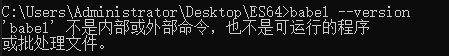
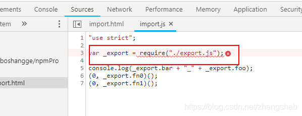
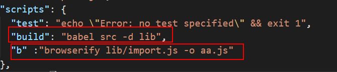

> javascript在不断的发展，各种新的标准和提案层出不穷，但是由于浏览器的多样性，导致可能几年之内都无法广泛普及，babel可以让你提前使用这些语言特性，他是一种用途很多的javascript编译器，他把最新版的javascript编译成当下可以执行的版本，简言之，利用babel就可以让我们在当前的项目中随意的使用这些新最新的es6，或者更高的语法。说白了就是把各种javascript千奇百怪的语言统统专为浏览器可以认识的语言。

官网：https://www.babeljs.cn/

#### 方法一：引入JS文件

~~~javascript
<script src="./babel.min.js"></script>
<script type="text/babel">
    let a = 10;
    let b = 20;
    alert(a + b);
</script>
~~~

##### 下载地址

- 这个下载地址有点难找，因为在官网找不到download按钮，去别的地方下吧有的还收费，那怎样找到最新版的下载地址呢？

1. 打开babel官网点击导航栏的 **设置**
2. 选中第一个选项 **in the browser**


3. 往下滑在**Usage**中找到script的代码块


4. 复制src里面的内容 浏览器打开
5. 复制里面的内容，新建文件粘贴即可

##### 使用

- script标签的type类型默认是 text/javascript 
- script标签一定是在要编译代码的前面
- 如果不修改默认type，代码还是按照的text/javascript 类型执行，而不是babel （不指定type等于没效果）
- **所以 使用引入JS的方法，不要忘了修改script的type为text/babel**

##### 优势和劣势

优势

1. 使用简单

劣势

1. 执行速度慢，在代码执行前要临时编译，会有延迟
2. babel.js本身都不支持在低级浏览器跑

一般使用babel都是编译完再引入，推荐使用第二种方法

#### 方法二：

1. 安装node

2. 生成package.json文件 加-y代表全部同意，不用一直回车

   ~~~js
   npm init -y
   ~~~

   - 之后文件里就会多一个package.json文件（项目的描述文件）
   - 什么是package.json？在Node.js中，模块是一个库或框架，也是一个Node.js项目。Node.js项目遵循模块化的架构，当我们创建了一个Node.js项目，意味着创建了一个模块，这个模块的描述文件，被称为package.json。

3. 安装babel（3个包,，局部安装）加@代表安装最新版

   ~~~js
   npm i @babel/core @babel/cli @babel/preset-env --save-dev
   ~~~

   - 第一个包是 babel的核心库，没有这个库就没有babel。core：核心
   - 第二个包是 命令行接口，执行babel要用到
   - 第三个包是 babel的预设库，调整参数用（只兼容IE7，或者只兼容IE9，再或者编译为ES5，还是ES6），env是环境预设。根据预设库去编译babel。
   - 建议局部安装是因为不会对环境产生依赖，安装的包都在项目的 （node_modules）中，每个项目的配置的不一样的。

   - package.json的文件就会自动修改（如果没有出现刚刚安装的版本号。重复执行一下第二步，看到版本号证明安装成功 比较安心）

   - ~~~js
     {
       "name": "es62",
       "version": "1.0.0",
       "main": "babel.min.js",
       "scripts": {
         "test": "echo \"Error: no test specified\" && exit 1"
         "build": "babel src -d dist"
       },
       "author": "",
       "license": "ISC",
       "keywords": [],
       "description": "",
       "devDependencies": {
         "@babel/cli": "^7.13.14",
         "@babel/core": "^7.13.15",
         "@babel/preset-env": "^7.13.15"
       }
     }
     
     ~~~

   - 要看到 刚刚安装的三个库的版本号

4. 配置.babelrc

   新建 .babelrc文件（没后缀）

   如果在文件内不允许新建不带后缀的文件，就用npm键 命令：`copy con .babelrc` ，再按ctrl+z 回车即可。

   配置babelrc的用处是：根据什么进行编译。如果不配置，编译时代码会原封不动的返回。因为代码不知道根据谁去编译。

   ~~~js
   {
       "presets": [
           "@babel/preset-env"
       ]
   }
   ~~~

5. 配置package.json命令

   - 在scripts里面可以配置一个build命令（名字不规定 build是打包的意思）

   - ~~~js
     "build": "babel src -d dist"
     ~~~

   - 第一个参数是运行谁，src是编译那个文件夹，-d 是往哪输出，dist是输出文件夹

   - 不配置命令 用 `npx babel src -d dist`也能执行

   - **使用npx可以在命令行直接执行本地已安装的依赖包命令，不用在scripts脚本写入命令**，也不用麻烦的去找本地脚本（node_modules）。

   - 

   - npx详细学习地址：https://www.jianshu.com/p/14c813bba544

6. 如果编译后有reqiure模块

   - 查看报错集合的第三项

#### 报错集合

##### 需要Babel "^7.0.0-0"，但已加载"6.26.3"。

~~~js
Error: Requires Babel "^7.0.0-0", but was loaded with "6.26.3". If you are sure you have a compatible version of @babel/core, it is likely that something in your build process is loading the wrong version. Inspect the stack trace of this error to look for the first entry that doesn't mention "@babel/core" or "babel-core" to see what is calling Babel. (While processing preset: "C:\\Users\\Administrator\\node_modules\\@babel\\preset-env\\lib\\index.js")
~~~

- 注意观察 package.json的三个包的版本号，如果前面都带@，跟着本教程的.babelrc配置是没错的。如果三个包的前面不带@，并且报此错误了，可以尝试以下方法

- 我以为babel-core（babel）版本太低了，去查了Babel版本 ` babel --version`如果报`babel不是内部命令`,就用` npx babel --version`查，返回`6.26.0 (babel-core 6.26.3)`,我就卸载安装最新版-卸载安装最新版-卸载安装最新版 问题还是不能解决。最后还去下了babel-loader包以为要配置loader（脑子怎么想的），实际在.babelrc中修改配置就行了：

~~~js
{
    "presets": [
        "env"
    ]
}
~~~

- 之前一直用的

~~~js
 {
    "presets": [
      "@babel/preset-env"
    ]
  }
~~~

##### 找不到babel


前面加：npx 执行 如：`npx babel --version`

npx详细学习地址：https://www.jianshu.com/p/14c813bba544

##### 找不到reqiure




- 产生这个问题的原因：（根本原因是模块化es6方式转化成require和exports的**commonJs**形式）。浏览器不识别**commonJS.**

  所以用进行打包处理（编译）。形成一个打包后的新文件。该文件在html中中引入即可。

- `Babel` 的作用是帮助我们转换 ES6 代码为 ES5, 但是它没有模块管理的功能，浏览器端默认也无法识别 `CommonJs` 规范，这就需要我们额外使用模块打包工具，为我们的代码做一些包裹，让它能在浏览器端使用。 比如 `Browserify`, `Webpack`。

- Babel 所做的只是帮你把‘ES6 模块化语法’转化为‘[CommonJS](http://javascript.ruanyifeng.com/nodejs/module.html) 模块化语法’，其中的`require` `exports` 等是 CommonJS 在具体实现中所提供的变量。

- 任何实现 CommonJS 规范的环境（如 node 环境）可以直接运行这样的代码，而浏览器环境并没有实现对 CommonJS 规范的支持，所以我们需要使用打包工具（bundler）来进行打包，说的直观一点就是把所有的模块组装起来，形成一个常规的 js 文件。

- 常用的打包工具包括 browserify webpack rollup 等。

###### browserify 

1. 首先用npm安装browserify

   ~~~js
   npm install  browserify --save-dev
   ~~~

2. 使用下面的命令，就能将b.js转为浏览器可用的格式bb.js

   ~~~js
   browserify src/index.js -o dist/index.js
   ~~~

   指定src文件夹下index.js 文件编译后生成到dist文件夹中，生成文件为index.js

   如果引入的文件特别多，选择哪个文件打包呢？入口文件（js文件），将生成的文件直接在html中引入即可。


- 引入aa.js 使用就行了



- 第一个babel命令，将文件夹src下的所有文件全部编译，生成新文件到lib文件夹中，lib文件夹中的所有代码都是commonJs形式。

- 第二个是browserify命令，将lib/import.js文件生成aa.js文件。

- 这块可能有疑问： lib文件夹中有两个.js文件。为什么只编译一个文件。因为import.js文件没有   exports了。仅仅有require()。

  也就是说，该文件中只是引入其他文件，用其他文件的API。browserify打包时（编译）会去找import.js中有没有require('./xx')如果有，它就会去找xx.js文件，接着将如果xx.js中还有require（'./xx2'）那它会接着去。直到js文件中没有了require（）才算完成。这样browserify会将所有文件中的代码都打包一个文件中。那就是aa.js文件

- 参考文献：https://blog.csdn.net/zhangshab/article/details/83714288

3. 配置package.json

   ~~~js
    "scripts": {
       "test": "echo \"Error: no test specified\" && exit 1",
       "build": "babel src -d dist",
       "b": "browserify dist/index.js -o out/main.js"
     }
   ~~~

###### webpack

1. 安装webpack和webpack-cli

   ~~~js
   npm install webpack webpack-cli --save-dev
   ~~~

   这里没有加@是怕高版本webpack不稳定（实际应该没啥事），因为也就打包个东西 

   查看版本号，出现版本号则证明安装成功

   ~~~js
   webpack -v
   ~~~

2. 更新package.json 

   ~~~js
   npm init -y
   ~~~

   正常情况下是自动更新的，要看到webpack版本号

3. #### 创建config文件夹并添加webpack.config.js文件

   ~~~js
   const path = require('path'); //调用node.js中的路径
   module.exports = {
       entry: {
           index: './dist' //需要打包的文件
       },
       output: {
           filename: '[name].js',    //输入的文件名是什么，生成的文件名也是什么
           path: path.resolve(__dirname, '../out/') //指定生成的文件目录
       },
       mode: "development"    //开发模式，没有对js等文件压缩，默认生成的是压缩文件
   }
   ~~~

   - **这一步学过node的应该明白，没学过node的多读注释**
   - 其实也可以不配置webpack.config.js文件（建议配置），执行 用 `webpack ./dist ./out/main.js`
   - 第一个是打包的地址，第二个是输出的地址，main.js不可变，
   - 不配置webpack.config 看似方便了，实则不懂node的很容易被绕晕，因为命令行报错是不可控的
   - 配置了webpack.config.js每次用的都是一样的命令，减少报错几率。

4. 执行

   ~~~js
   webpack --config config/webpack.config.js
   ~~~

5. 配置package.json

   每次输入命令webpack --config config/webpack.config.js，太长，且非常不方便，此时我们可以在package.json文件中配置，如下所示：

   ~~~js
    "scripts": {
       "test": "echo \"Error: no test specified\" && exit 1",
       "build": "babel src -d dist",
       "b": "browserify dist/index.js -o out/main.js",
       "start": "webpack --config config/webpack.config.js"
     }
   ~~~

   配置完成后，我们输入的如下命令，可以直接打包。

   ```
   npm run start
   ```

- build 是打包成 commonJS 形式
- b是使用的 browserify 打包
- start是使用的 webpack打包

参考文献：https://www.cnblogs.com/aizai846/p/11497508.html

