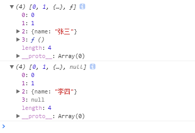
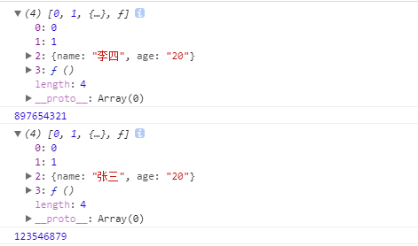

#### 数据类型

 数据分为基本数据类型(String, Number, Boolean, Null, Undefined)。引用数据类型（统称为 `Object ``类型`，细分的话有：`Object `、`Array `、`Date `、`RegExp`、`Function…` ）。

- 基本数据类型的特点：**直接存储在栈(stack)中的数据**
- 引用数据类型的特点：**存储的是该对象在栈中引用，真实的数据存放在堆内存里**

 引用数据类型在栈中存储了指针，该指针指向堆中该实体的**起始地址**。当解释器寻找引用值时，会首先检索其在栈中的**地址**，取得地址后从堆中获得实体。

#### 深拷贝与浅拷贝

- 深拷贝和浅拷贝是只针对Object和Array这样的引用数据类型的。

- ==**浅拷贝**复制指向某个对象的指针而不复制对象本身，新旧对象还是共享**同一块内存**。==

- ==**深拷贝**会另外创造一个一模一样的对象，新对象跟原对象不共享内存，修改新对象不会改到原对象。==

#### 赋值和浅拷贝的区别

- 赋值和浅拷贝是不一样的。一个是内存地址 一个是依次拷贝（不包含引用类型）。如果非要排个顺序的话 赋值 < 浅拷贝 < 深拷贝

- 当我们把一个对象赋值给一个新的变量时，**赋的其实是该对象的在栈中的地址，而不是堆中的数据**。也就是两个对象指向的是同一个存储空间，无论哪个对象发生改变，其实都是改变的存储空间的内容，因此，**两个对象是联动的。**
- 浅拷贝是按位拷贝对象，**它会创建一个新对象**，这个对象有着原始对象属性值的一份精确拷贝。如果属性是基本类型，拷贝的就是基本类型的值；如果属性是内存地址（引用类型），拷贝的就是内存地址 ，因此如果其中一个对象改变了这个地址，就会影响到另一个对象。即：默认拷贝构造函数只是对对象进行浅拷贝复制(逐个成员依次拷贝)，即只复制对象空间而不复制资源。
- 赋值

~~~JavaScript
  // 赋值
    let obj = {
        name: "zml",
        age: "20",
        sex: "man"
    }
   let o = obj;
    console.log(obj);
    console.log(o);
    // 因为指向的是同一个内存地址，改变一个，另一个也会改变。证明两个对象是联动的
    o.name = 'zmllll';
    console.log(obj);
    console.log(o);
~~~

- 浅拷贝

~~~javascript
    // 浅拷贝函数
    function shallowCopy(src) {
        var dst = {};
        for (var prop in src) {
            if (src.hasOwnProperty(prop)) {
                dst[prop] = src[prop];
            }
        }
        return dst;
    }
    let obj = {
        name: "张梦龙",
        age: "20",
        sex: "man"
    }
    let o = shallowCopy(obj);
    // 浅拷贝后，再修改内容。
    o.name = '张三';
    console.log(obj); // 原始对象没发生变化
    console.log(o); // 现对象发生变化
~~~

- 下面这张图可以加深理解

- 原数据中包含子对象意思是：第一层的基本数据类型里有引用类型，这时 改变引用类型的值，原数据也会发生改变。

#### 浅拷贝的简洁实现方法

##### **Object.assign()**

- Object.assign() 方法可以把任意多个的源对象自身的可枚举属性拷贝给目标对象，然后返回目标对象。但是 Object.assign()进行的是浅拷贝，拷贝的是对象的属性的引用，而不是对象本身。第一个值是新对象，第二个值是要拷贝的对象
- 当对象是基本数据类型的时候 **是深拷贝**

~~~JavaScript
 let obj = {
        name: "张梦龙",
        age: "20",
        sex: "man"
    }
    let o = {};
    Object.assign(o, obj);
    o.name = '张三';
    console.log('原始对象');
    console.log(obj);
    console.log('修改后对象');
    console.log(o);
~~~

- 当对象是引用类型的时候 是**浅拷贝**（基本数据类型还是深拷贝）

~~~javascript
    let obj = {
        name: "张梦龙",
        age: "20",
        sex: "man",
        hobby: ["学习", "敲代码"],
    }
    let o = {};
    Object.assign(o, obj);
    o.hobby[0] = '睡觉';
    console.log(o);
    console.log(obj);
~~~

##### ***Array.concat()***

~~~JavaScript
let arr = [1, 3, {
        username: '张三'
    }];
    let arr2 = arr.concat();
    arr2[2].username = '李四'; // 修改引用类型 会修改原对象
    arr2[0] = 10; // 修改基本类型 不会修改原对象
    console.log(arr2);
    console.log(arr);
~~~

***Array.slice()***

~~~javascript
let arr = [1, 3, {
        username: '张三'
    }];
    let arr2 = arr.slice();
    arr2[2].username = '李四'; // 修改引用类型 会修改原对象
    arr2[0] = 10; // 修改基本类型 不会修改原对象
    console.log(arr2);
    console.log(arr);
~~~

##### 展开运算符实现浅拷贝

~~~JavaScript
 var arr1=[1,2,5,6,4];
 var arr2=[...arr1];
 arr1 == arr2      // false;
~~~

##### **关于Array的slice和concat方法的补充说明**：

Array的slice和concat方法不修改原数组，只会返回一个浅复制了原数组中的元素的一个新数组。

原数组的元素会按照下述规则拷贝：

- 如果该元素是个对象引用(不是实际的对象)，**slice 会拷贝这个对象引用到新的数组里**。两个对象引用都引用了同一个对象。如果被引用的对象发生改变，则新的和原来的数组中的这个元素也会发生改变。
- 对于字符串、数字及布尔值来说（不是 String、Number 或者 Boolean 对象），slice 会拷贝这些值到新的数组里。在别的数组里修改这些字符串或数字或是布尔值，将不会影响另一个数组。

#### 深拷贝

- 深拷贝是拷贝的堆内存中的数据，因此指向的不是一个内存空间，修改不会影响原始的数据。

##### JSON.parse(JSON.stringify())

~~~JavaScript
    let arr = [0, 1, {
        name: "张三"
    }];
    let arr2 = JSON.parse(JSON.stringify(arr))
    arr2[2].name = '李四';
    console.log(arr);
    console.log(arr2);
~~~

- 原理： 用JSON.stringify将对象转成JSON字符串，再用JSON.parse()把字符串解析成对象，一去一来，新的对象产生了，而且对象会开辟新的栈，实现深拷贝。

==这种方法虽然可以实现数组或对象深拷贝,但不能处理函数==

~~~JavaScript
   let arr = [0, 1, {
        name: "张三"
    }, function () {
        console.log(123546879);
    }];
    let arr2 = JSON.parse(JSON.stringify(arr))
    arr2[2].name = '李四';
    console.log(arr);
    console.log(arr2);
~~~

- 这里显示null
- 使用JSON.parse这种方法深拷贝需要注意一下几点

1. 如果obj里面存在时间对象，JSON.parse(JSON.stringify(obj))之后，时间对象变成了字符串。
2. 如果obj里有RegExp、Error对象，则序列化的结果将只得到空对象。
3. 如果obj里有函数，undefined，则序列化的结果会把函数， undefined丢失。
4. 如果obj里有NaN、Infinity和-Infinity，则序列化的结果会变成null。
5. JSON.stringify()只能序列化对象的**可枚举的自有属性**。如果obj中的对象是有构造函数生成的， 则使用JSON.parse(JSON.stringify(obj))深拷贝后，会丢弃对象的constructor。
6. 如果对象中存在循环引用的情况也无法正确实现深拷贝。

##### 手写递归方法

递归方法实现深度克隆原理：**遍历对象、数组直到里边都是基本数据类型，然后再去复制，就是深度拷贝**

- 雏形

~~~JavaScript
    let obj = {
        name: 'zml',
        info: [0, 1, function () {
            console.log(123);
        }],
    }
    function clone(obj) {
        let newobj = {};
        for (let k in obj) {
            newobj[k] = obj[k];  //这里可以理解为数据的映射
        }
        return newobj;
    }
    let new_obj = clone(obj);
    new_obj.name = '李四';
    console.log(obj);
    console.log(new_obj);
~~~

- 以上代码还没有开始递归，这个操作只能算是映射，**实现的是基础数据类型的深拷贝，引用类型的浅拷贝**。
- 递归

~~~javascript
  let obj = {
        name: 'zml',
        info: [0, 1, function () {
            console.log(123);
        }],
    }
    function clone(obj) {
        // 如果传入的不是对象就直接返回出去
        if (!typeof obj === 'object' && obj !== null) return obj;
        // 生成字面量的兼容写法，因为 数组也是对象，那么生成字面量就至关重要了,如果是数组就返回数字的字面量，如果不是就返回对象的字面量
        let target = Array.isArray(obj) ? [] : {};
        for (let k in obj) {
            if (obj.hasOwnProperty(k)) {
                // 如果是对象则证明不是基本数据类型，就用递归把对象里的数据再执行一边。通过递归对象 里的东西就变为了基本数据类型，就可以进入到下面了if了。
                if (typeof obj[k] === 'object') {
                    target[k] = clone(obj[k]); //这里传的值 一定不是基本数据类型
                } else {  //如果是基本数据类型就直接映射
                    target[k] = obj[k];
                }
            }
        }
        return target;
    }
    let new_obj = clone(obj);
    new_obj.name = '李四'; //基本数据类型深拷贝成功
    console.log(obj);
    console.log(new_obj);
    new_obj.info[0] = 1111;//引用类型深拷贝成功
    console.log(obj);
    console.log(new_obj);
~~~

- hasOwnProperty() 方法用来检测一个属性是否是对象的自有属性，而不是从原型链继承的。如果该属性是自有属性，那么返回 true，否则返回 false。换句话说，hasOwnProperty() 方法不会检测对象的原型链，只会检测当前对象本身，只有当前对象本身存在该属性时才返回 true。

- 例如，在下面自定义类型中，this.name 就表示对象的自有属性，而原型对象中的 name 属性就是继承属性。

- ~~~javascript
  function F() {  //自定义数据类型
      this.name = "自有属性";
  }
  F.prototype.name = "继承属性";
  ~~~

##### 封装深拷贝最严谨的写法

~~~javascript
    function clone(obj) {
        if (obj === null) return null
        if (typeof obj !== 'object') return obj;
        if (obj.constructor === Date) return new Date(obj);
        var newObj = new obj.constructor();  //保持继承链
        for (var key in obj) {
            if (obj.hasOwnProperty(key)) {   //不遍历其原型链上的属性
                var val = obj[key];
                newObj[key] = typeof val === 'object' ? arguments.callee(val) : val; // 使用arguments.callee解除与函数名的耦合
            }
        }
        return newObj;
    };

    let new_arr = clone(arr);
    console.log(new_arr);
    new_arr[2].name = '李四'; // 修改克隆后的数据
    new_arr[3] = function () {// 修改克隆后的函数
        console.log(897654321);
    };
    new_arr[3](); // 克隆后的发生改变
    console.log(arr);
    arr[3](); // 原元素的未改变
~~~

参考文献：https://blog.csdn.net/weixin_41082623/article/details/88084831