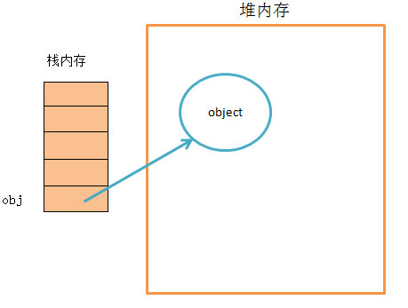
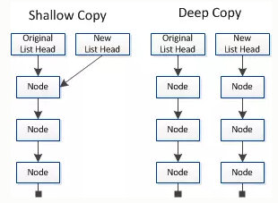
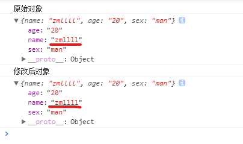
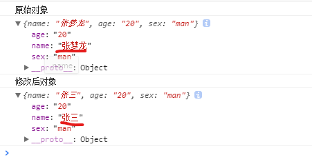
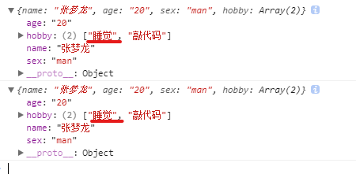
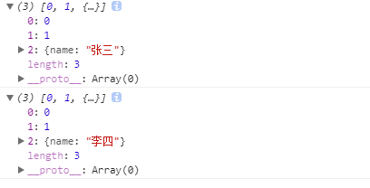

#### 数据类型

 数据分为基本数据类型(String, Number, Boolean, Null, Undefined)。引用数据类型（统称为 `Object ``类型`，细分的话有：`Object `、`Array `、`Date `、`RegExp`、`Function…` ）。

- 基本数据类型的特点：**直接存储在栈(stack)中的数据**
- 引用数据类型的特点：**存储的是该对象在栈中引用，真实的数据存放在堆内存里**

 引用数据类型在栈中存储了指针，该指针指向堆中该实体的**起始地址**。当解释器寻找引用值时，会首先检索其在栈中的**地址**，取得地址后从堆中获得实体。

#### 深拷贝与浅拷贝

- 深拷贝和浅拷贝是只针对Object和Array这样的引用数据类型的。

- ==**浅拷贝**复制指向某个对象的指针而不复制对象本身，新旧对象还是共享**同一块内存**。==

- ==**深拷贝**会另外创造一个一模一样的对象，新对象跟原对象不共享内存，修改新对象不会改到原对象。==

#### 赋值和浅拷贝的区别

- 赋值和浅拷贝是不一样的。一个是内存地址 一个是依次拷贝（不包含引用类型）。如果非要排个顺序的话 赋值 < 浅拷贝 < 深拷贝

- 当我们把一个对象赋值给一个新的变量时，**赋的其实是该对象的在栈中的地址，而不是堆中的数据**。也就是两个对象指向的是同一个存储空间，无论哪个对象发生改变，其实都是改变的存储空间的内容，因此，**两个对象是联动的。**
- 浅拷贝是按位拷贝对象，**它会创建一个新对象**，这个对象有着原始对象属性值的一份精确拷贝。如果属性是基本类型，拷贝的就是基本类型的值；如果属性是内存地址（引用类型），拷贝的就是内存地址 ，因此如果其中一个对象改变了这个地址，就会影响到另一个对象。即：默认拷贝构造函数只是对对象进行浅拷贝复制(逐个成员依次拷贝)，即只复制对象空间而不复制资源。
- 赋值

~~~JavaScript
  // 赋值
    let obj = {
        name: "zml",
        age: "20",
        sex: "man"
    }
   let o = obj;
    console.log(obj);
    console.log(o);
    // 因为指向的是同一个内存地址，改变一个，另一个也会改变。证明两个对象是联动的
    o.name = 'zmllll';
    console.log(obj);
    console.log(o);
~~~

- 浅拷贝

~~~javascript
    // 浅拷贝函数
    function shallowCopy(src) {
        var dst = {};
        for (var prop in src) {
            if (src.hasOwnProperty(prop)) {
                dst[prop] = src[prop];
            }
        }
        return dst;
    }
    let obj = {
        name: "张梦龙",
        age: "20",
        sex: "man"
    }
    let o = shallowCopy(obj);
    // 浅拷贝后，再修改内容。
    o.name = '张三';
    console.log(obj); // 原始对象没发生变化
    console.log(o); // 现对象发生变化
~~~

- 下面这张图可以加深理解

- 原数据中包含子对象意思是：第一层的基本数据类型里有引用类型，这时 改变引用类型的值，原数据也会发生改变。

#### 浅拷贝的简洁实现方法

##### **Object.assign()**

- Object.assign() 方法可以把任意多个的源对象自身的可枚举属性拷贝给目标对象，然后返回目标对象。但是 Object.assign()进行的是浅拷贝，拷贝的是对象的属性的引用，而不是对象本身。第一个值是新对象，第二个值是要拷贝的对象
- 当对象是基本数据类型的时候 **是深拷贝**

~~~JavaScript
 let obj = {
        name: "张梦龙",
        age: "20",
        sex: "man"
    }
    let o = {};
    Object.assign(o, obj);
    o.name = '张三';
    console.log('原始对象');
    console.log(obj);
    console.log('修改后对象');
    console.log(o);
~~~

- 当对象是引用类型的时候 是**浅拷贝**（基本数据类型还是深拷贝）

~~~javascript
    let obj = {
        name: "张梦龙",
        age: "20",
        sex: "man",
        hobby: ["学习", "敲代码"],
    }
    let o = {};
    Object.assign(o, obj);
    o.hobby[0] = '睡觉';
    console.log(o);
    console.log(obj);
~~~

##### ***Array.concat()***

~~~JavaScript
let arr = [1, 3, {
        username: '张三'
    }];
    let arr2 = arr.concat();
    arr2[2].username = '李四'; // 修改引用类型 会修改原对象
    arr2[0] = 10; // 修改基本类型 不会修改原对象
    console.log(arr2);
    console.log(arr);
~~~

***Array.slice()***

~~~javascript
let arr = [1, 3, {
        username: '张三'
    }];
    let arr2 = arr.slice();
    arr2[2].username = '李四'; // 修改引用类型 会修改原对象
    arr2[0] = 10; // 修改基本类型 不会修改原对象
    console.log(arr2);
    console.log(arr);
~~~

##### **关于Array的slice和concat方法的补充说明**：

Array的slice和concat方法不修改原数组，只会返回一个浅复制了原数组中的元素的一个新数组。

原数组的元素会按照下述规则拷贝：

- 如果该元素是个对象引用(不是实际的对象)，**slice 会拷贝这个对象引用到新的数组里**。两个对象引用都引用了同一个对象。如果被引用的对象发生改变，则新的和原来的数组中的这个元素也会发生改变。
- 对于字符串、数字及布尔值来说（不是 String、Number 或者 Boolean 对象），slice 会拷贝这些值到新的数组里。在别的数组里修改这些字符串或数字或是布尔值，将不会影响另一个数组。

#### 深拷贝

##### JSON.parse(JSON.stringify())

~~~JavaScript
    let arr = [0, 1, {
        name: "张三"
    }];
    let arr2 = JSON.parse(JSON.stringify(arr))
    arr2[2].name = '李四';
    console.log(arr);
    console.log(arr2);
~~~

- 原理： 用JSON.stringify将对象转成JSON字符串，再用JSON.parse()把字符串解析成对象，一去一来，新的对象产生了，而且对象会开辟新的栈，实现深拷贝。

==这种方法虽然可以实现数组或对象深拷贝,但不能处理函数==

https://blog.csdn.net/weixin_41082623/article/details/88084831