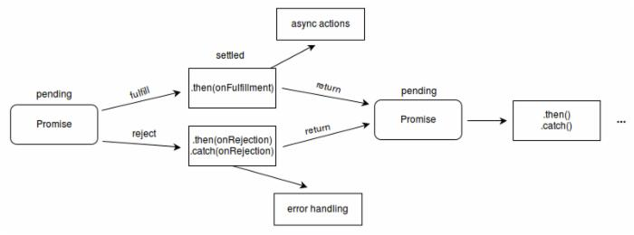

#### promise

##### promise是什么？

- 主要用于异步计算
- 可以将异步操作队列化，按照期望的顺序执行，返回符合预期的结果
- 并未剥夺函数return的能力，因此无需层层传递callback，进行回调获取数据

##### 异步回调的问题(回调地狱)

- 之前处理异步是通过纯粹的回调函数的形式进行处理
- 很容易进入到回调地狱中，剥夺了函数return的能力
- 问题可以解决，但是难以读懂，维护困难
- 稍有不慎就会踏入**回调地狱** - 嵌套层次深，不好维护


- 一般情况我们一次性调用API就可以完成请求。有些情况需要多次调用服务器API，就会形成一个链式调用，比如为了完成一个功能，我们需要调用API1、API2、API3，依次按照顺序进行调用，这个时候就会出现回调地狱的问题

##### promise语法

~~~javascript
 new Promise(function (resolve, reject) {
        setTimeout(function () {
            resolve('hello');
        }, 2000);
    }).then(function (re) {
        console.log(re);
    }).catch(function (err) {
        console.log(err);
    })
~~~

简写

~~~JavaScript
//这种简写语法也可以 使用了箭头函数
new Promise(
  function (resolve, reject) {
    // 一段耗时的异步操作
    resolve('成功') // 数据处理完成
    // reject('失败') // 数据处理出错
  }
).then(
  (res) => {console.log(res)},  // 成功
  (err) => {console.log(err)} // 失败
)
~~~

分离写法

~~~JavaScript
    // 请求
    let data1 = new Promise(function (resolve, reject) {
        setTimeout(function () {
            resolve('music2');
        }, 1000);
    })
    // then
    data1.then(function (data) {
        console.log(data);
    })
    data1.catch(function (err) {
        console.log(err);
    })
    // then也可以这样写 省去了catch
    data1.then((res) => { console.log(res) }, (err) => { console.log(err) })
~~~

- resolve作用是，将Promise对象的状态从“未完成”变为“成功”（即从 pending 变为 resolved），在异步操作成功时调用，并将异步操作的结果，作为参数传递出去；
- reject作用是，将Promise对象的状态从“未完成”变为“失败”（即从 pending 变为 rejected），在异步操作失败时调用，并将异步操作报出的错误，作为参数传递出去。
- 当promise状态发生改变，就会触发then()里的响应函数处理后续步骤；

##### then

- 接收两个函数作为参数，分别代表fulfilled（成功）和rejected（失败）
- .then()返回一个新的Promise实例，所以它可以链式调用
- 当前面的Promise状态改变时，.then()根据其最终状态，选择特定的状态响应函数执行

链式调用

~~~JavaScript
   new Promise(function (resolve, reject) {
        setTimeout(function () {
            resolve('hello');
        }, 2000);
    }).then(function (re) {
        // 第二个promise
        console.log(re);
        return new Promise(function (resolve, reject) {
            setTimeout(function () {
                resolve('world');
            }, 2000);
        })
    }).then(function (re) {
        console.log(re);
        // 第三个then
        return new Promise(function (resolve, reject) {
            setTimeout(function () {
                resolve('music');
            }, 1000);
        })
    }).then(function (re) {
        console.log(re);
    })
~~~

##### primise.all批量执行

- Promise.all([p1, p2, p3])用于将多个promise实例，包装成一个新的Promise实例，返回的实例就是普通的promise
- 它接收一个数组作为参数
- 数组里可以是Promise对象，也可以是别的值，只有Promise会等待状态改变
- **当所有的子Promise都完成，该Promise完成，返回值是全部值得数组**
- **有任何一个失败，该Promise失败，返回值是第一个失败的子Promise结果**

~~~javascript
    let pro1 = new Promise(function (resolve, reject) { resolve('成功了1'); reject('失败1') });
    let pro2 = new Promise(function (resolve, reject) { resolve('成功了2'); reject('失败2') });
    let pro3 = new Promise(function (resolve, reject) { reject('失败3') });
    Promise.all([pro1, pro2, pro3]
    ).then(function (result) {
        console.log(result);
    }).catch(function (err) {
        console.log(err);
    })

// 或者

//切菜
    function cutUp(){
        console.log('开始切菜。');
        var p = new Promise(function(resolve, reject){        //做一些异步操作
            setTimeout(function(){
                console.log('切菜完毕！');
                resolve('切好的菜');
            }, 1000);
        });
        return p;
    }

    //烧水
    function boil(){
        console.log('开始烧水。');
        var p = new Promise(function(resolve, reject){        //做一些异步操作
            setTimeout(function(){
                console.log('烧水完毕！');
                resolve('烧好的水');
            }, 1000);
        });
        return p;
    }

    Promise.all([cutUp(), boil()])
        .then((result) => {
            console.log('准备工作完毕');
            console.log(result);
        })
~~~

- 注意promise ALL 的then的成功是 必须是全部都成功 失败是只要有一个失败就会失败
- promise可以链式调用     then点then 而不是then套then

##### Promise.race

- 竞速的意思 谁先加载成功谁先上   

```JavaScript
let p1 = new Promise(resolve => {
    setTimeout(() => {
        resolve('I\`m p1 ')
    }, 1000)
});
let p2 = new Promise(resolve => {
    setTimeout(() => {
        resolve('I\`m p2 ')
    }, 1000)
});
Promise.race([p1, p2])
    .then(value => {
        console.log(value)
    })
```

##### 回调地狱和promise对比：

```jsx
/***
   第一步：找到北京的id
   第二步：根据北京的id -> 找到北京公司的id
   第三步：根据北京公司的id -> 找到北京公司的详情
   目的：模拟链式调用、回调地狱
 ***/
 
 // 回调地狱
 // 请求第一个API: 地址在北京的公司的id
 $.ajax({
   url: 'https://www.easy-mock.com/mock/5a52256ad408383e0e3868d7/lagou/city',
   success (resCity) {
     let findCityId = resCity.filter(item => {
       if (item.id == 'c1') {
         return item
       }
     })[0].id
     
     $.ajax({
       //  请求第二个API: 根据上一个返回的在北京公司的id “findCityId”，找到北京公司的第一家公司的id
       url: 'https://www.easy-mock.com/mock/5a52256ad408383e0e3868d7/lagou/position-list',
       success (resPosition) {
         let findPostionId = resPosition.filter(item => {
           if(item.cityId == findCityId) {
             return item
           }
         })[0].id
         // 请求第三个API: 根据上一个API的id(findPostionId)找到具体公司，然后返回公司详情
         $.ajax({
           url: 'https://www.easy-mock.com/mock/5a52256ad408383e0e3868d7/lagou/company',
           success (resCom) {
             let comInfo = resCom.filter(item => {
               if (findPostionId == item.id) {
                 return item
               }
             })[0]
             console.log(comInfo)
           }
         })
       }
     })
   }
 })
```

```jsx
// Promise 写法
  // 第一步：获取城市列表
  const cityList = new Promise((resolve, reject) => {
    $.ajax({
      url: 'https://www.easy-mock.com/mock/5a52256ad408383e0e3868d7/lagou/city',
      success (res) {
        resolve(res)
      }
    })
  })

  // 第二步：找到城市是北京的id
    cityList.then(res => {
      let findCityId = res.filter(item => {
        if (item.id == 'c1') {
          return item
        }
      })[0].id
      
   // 第三步（1）：根据北京的id -> 找到北京公司的id
  function findCompanyId () {
    let aaa = new Promise((resolve, reject) => {
      $.ajax({
        url: 'https://www.easy-mock.com/mock/5a52256ad408383e0e3868d7/lagou/position-list',
        success (res) {
          resolve(res)
        }
      })
    })
    return aaa
  }
      
      findCompanyId().then(res => {
        // 第三步（2）：根据北京的id -> 找到北京公司的id
        let findPostionId = res.filter(item => {
            if(item.cityId == findCityId) {
              return item
            }
        })[0].id

        // 第四步（2）：传入公司的id
        companyInfo(findPostionId)

      })

    })


// 第四步：根据上一个API的id(findPostionId)找到具体公司，然后返回公司详情
function companyInfo (id) {
  let companyList = new Promise((resolve, reject) => {
    $.ajax({
      url: 'https://www.easy-mock.com/mock/5a52256ad408383e0e3868d7/lagou/company',
      success (res) {
        let comInfo = res.filter(item => {
            if (id == item.id) {
               return item
            }
        })[0]
        console.log(comInfo)
      }
    })
  })
}
```

#### generator 

- 语法：
  - 必须有*贴在函数
  - yield;是中断的意思
  - 结果需要声明变量接收    rel.next(); 是走一步的意思

~~~javascript
     function* getAjax() {
        let font = yield $.ajax({
            url: "http://tg.520-love.top/api.php",
            dataType: 'jsonp'
        });
        let img = yield $.ajax({
            url: "http://www.dmoe.cc/random.php",
            dataType: 'jsonp'
        });
        console.log(font);
        console.log(img);
    }
    let it = getAjax();
    it.next();
    it.next();
~~~


#### async——await

~~~javascript
    async function show() {
        try {   //成功的时候
            let data1 = await $.ajax({ url: './data/1.txt', dataType: "json" });
            let data2 = await $.ajax({ url: './data/2.json', dataType: "json" });
            console.log(data1, data2);
            //中间可以插入判断
            if (data2.name == 123) {
                let data3 = await $.ajax({ url: './data/3.txt', dataType: "json" });
                console.log(data1, data2, data3);
            }
        } catch{    //失败的时候
            console.log('出错');
        }
    }
    show();
~~~

