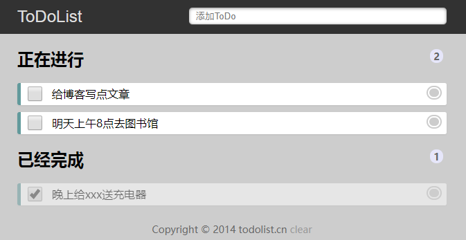

#### 演示地址：http://zmlong.usa3v.net/html/project/todolist/index.html

#### 介绍：

- ToDoList无须注册即可使用,数据存储在用户浏览器的html5本地数据库里,是最简单最安全的待办事项列表应用!
- Todolist是一款适合程序员管理日常工作的日志记录软件
- **ToDoList**是一款非常优秀的[任务管理](https://baike.baidu.com/item/任务管理/10163240)软件，用户可以用它方便地组织和安排计划。该软件短小精悍，仅有一个 数百 KB 的[可执行文件](https://baike.baidu.com/item/可执行文件)就能完成所有功能，并且[界面设计](https://baike.baidu.com/item/界面设计/2155896)优秀，初级用户也能够快速上手

#### 官网：http://www.todolist.cn/

#### 技术：

- 移动、pc自适应布局
- 用浏览器内置的 local Storage 记录数据 占用内存少 执行速度快 数据不易丢失
- 防错别字 ：双击修改文字 不用删除重写
- local Storage 的增加、删除、改变、查看 都用到了