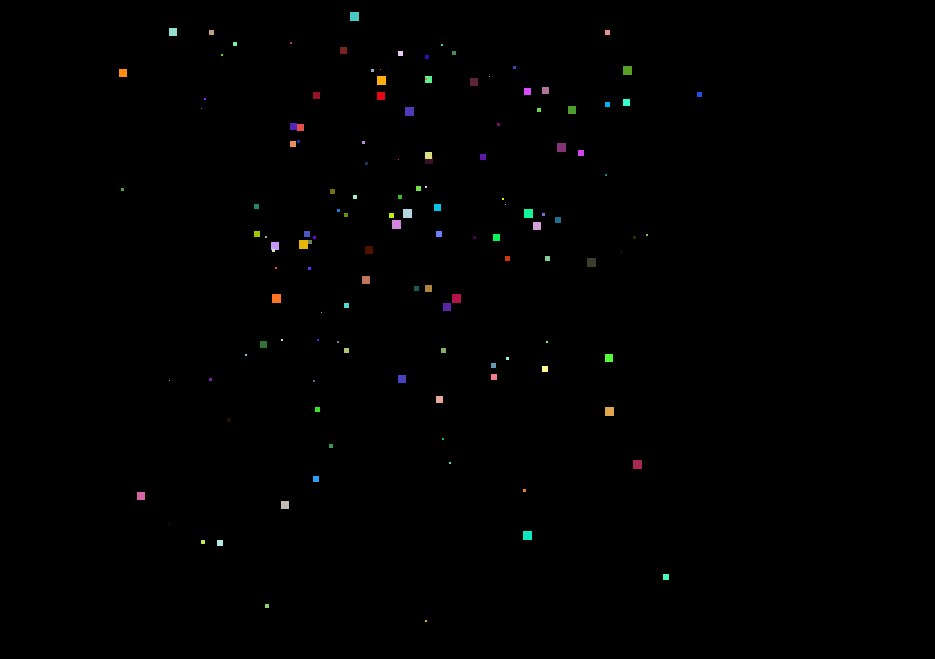

#### 演示地址：http://zmlong.usa3v.net/html/project/fireworks/fireworks.html

#### 介绍：

- 利用JS 实现烟花效果，烟花样式大小和运动的方向都是随机的
- 如果想要修改烟花样式  js 内 randomSize函数是方形（随机大小）
- 如果想要修改烟花样式  js 内 rect函数是长方形（随机宽高）
- 可以再添加烟花的样式

#### 技术：

- 封装一个随机颜色

~~~JavaScript
  //  随机颜色函数
    function randomColor() {
        let color = 'rgb(';
        let r = Math.floor(Math.random() * 256);
        let g = Math.floor(Math.random() * 256);
        let b = Math.floor(Math.random() * 256);
        color = color + r + ',' + g + ',' + b + ')';
        return color;
    }
~~~

- 随机方向、随机速度
  - ​         三目运算符 返回的不是1 就是 -1  然后x后面的速度 就是最终结果。后面的 这个值是控制 烟花与烟花之间的距离

~~~JavaScript
        let speedX = (Math.floor(Math.random() * 2) == 0 ? 1 : -1) * Math.floor(Math.random() * 20);
        let speedY = (Math.floor(Math.random() * 2) == 0 ? 1 : -1) * Math.floor(Math.random() * 20);
~~~

- 定时器的运用和dom的增加删除