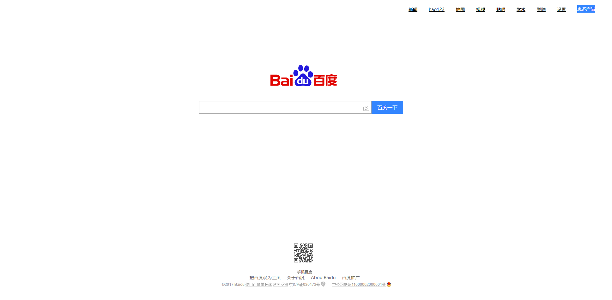
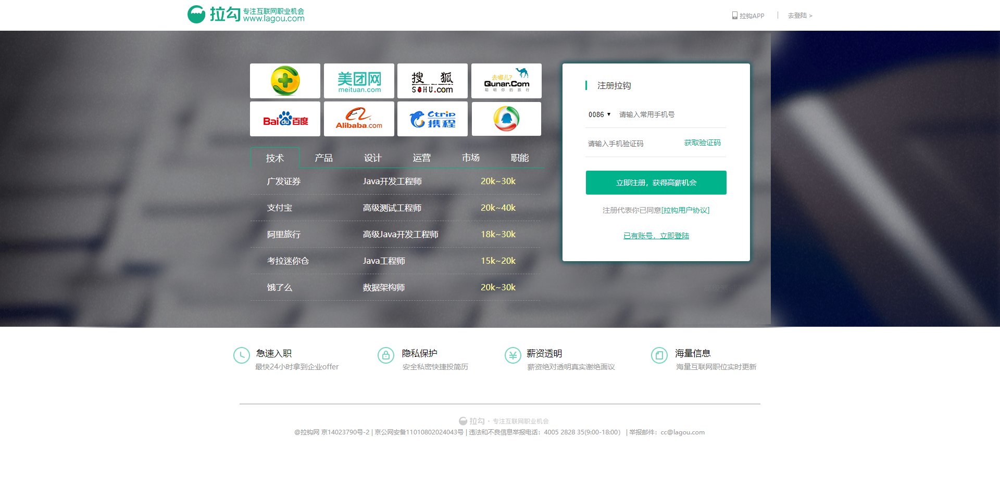

#### 接触前端第一年做的第一个网页

- 虽然没什么技术难度 那时候硬是高兴了半个月
- 而且写了不下三遍 第一遍写了一星期，第二遍写了一整天，第三遍作为了期末考试作业 写了一个晚自习 
- 参考地址：http://zmlong.usa3v.net/html/project/baidu/index.html
- 可能有很多不足之处 我觉得没必要去优化，优化了还能看出当时写代码的那种懵懂感嘛，此篇博文要的就是最初写代码稚嫩的感觉 下面同理。

 ==分割线==

------

#### 学前端做的第二个网页

- 这个时候已经接触JS了 布局也用的是 flex布局 感觉很神奇
- 那时候听老师说到最多的的一句话就是： html是骨架 css 是外表  js 是行为
- JS写了选项卡效果、划入划出效果、获取验证码倒计时效果、还有判断验证码的正则表达式
- 也算是 入门前端 三件套了，满满的成就感
- 参考地址：http://zmlong.usa3v.net/html/project/lagou/index.html

==分割线==

------

#### 学前端做的第三个网页

- 这个时候应该是又一年的期末，老师以它作为了期末考试的科目之一

- 这也应该是 当时写的最好看的网页了

- 这次考试到上次 强化了JS ， 接触了插件（Swiper 写的轮播图），强化了flex布局

- 可把我牛坏了 截图发朋友圈都打消不了我的成就感！

- 参考地址：因为图片多 放服务器有些浪费资源 就没放

  

**当我还沉迷在自己强烈成就感的时候 恍然不知 以后的路是越来越难走了—— ==代码课取消了==，因为我的专业是 ==跨境电商==，代码只需要了解，学习重点要放在运营店铺上 。之后虽然我热爱代码的心依然不减 但是学习却无从下手，而且新开的课也要及格，导致我踌躇不前、原地踏步了半年，之后我恍然大悟 开启了艰辛的自学之旅（一把泪），然后你们就看到我写的品优购 就是自学的，网上天天找视频看 也倒是激发了我的自学心，写品优购的时候 时常写到深夜都是常事，状态就是白天看视频学 晚上实现。实现不了睡觉都不踏实 可能我这个人比较较真。**