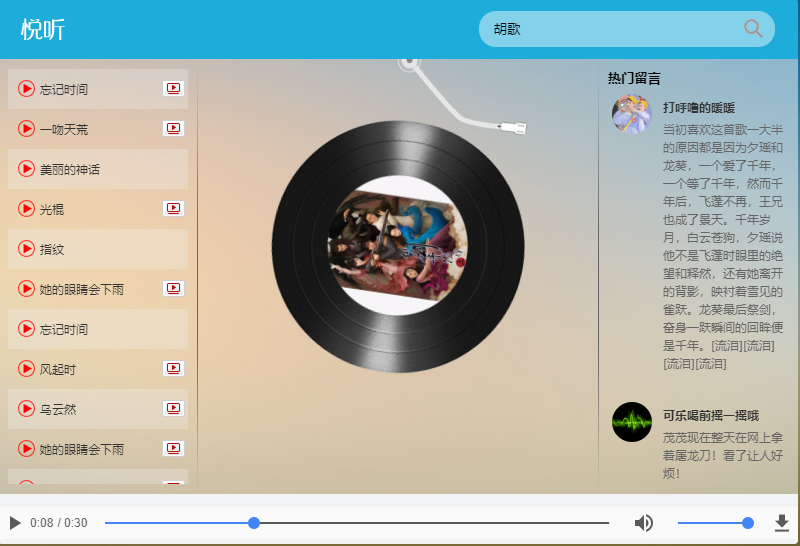

#### 预览地址：http://zmlong.usa3v.net/html/project/music_vue/index.html

#### 接口详情：

~~~js
/*
  1:歌曲搜索接口
    请求地址:https://autumnfish.cn/search
    请求方法:get
    请求参数:keywords(查询关键字)
    响应内容:歌曲搜索结果
  2:歌曲url获取接口
    请求地址:https://autumnfish.cn/song/url
    请求方法:get
    请求参数:id(歌曲id)
    响应内容:歌曲url地址
  3.歌曲详情获取
    请求地址:https://autumnfish.cn/song/detail
    请求方法:get
    请求参数:ids(歌曲id)
    响应内容:歌曲详情(包括封面信息)
  4.热门评论获取
    请求地址:https://autumnfish.cn/comment/hot?type=0
    请求方法:get
    请求参数:id(歌曲id,地址中的type固定为0)
    响应内容:歌曲的热门评论
  5.mv地址获取
    请求地址:https://autumnfish.cn/mv/url
    请求方法:get
    请求参数:id(mvid,为0表示没有mv)
    响应内容:mv的地址
*/
~~~

